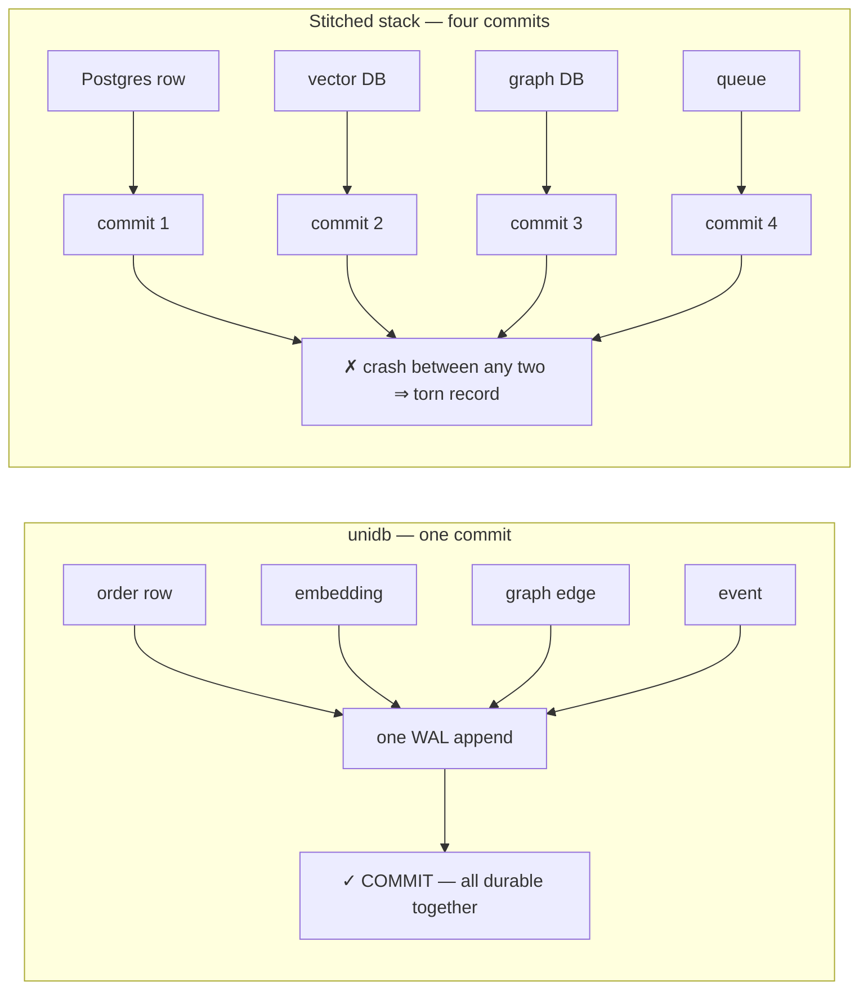
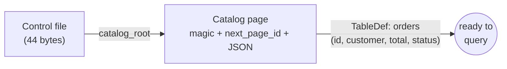
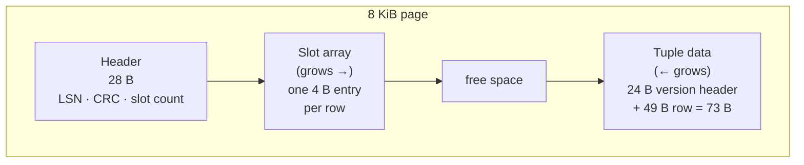
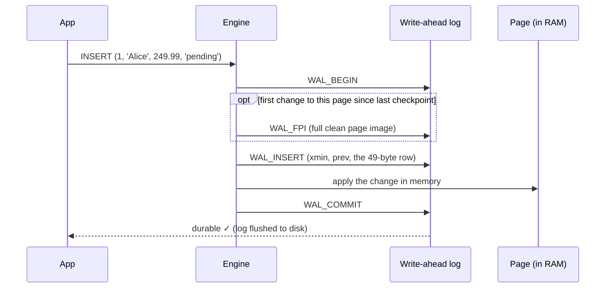
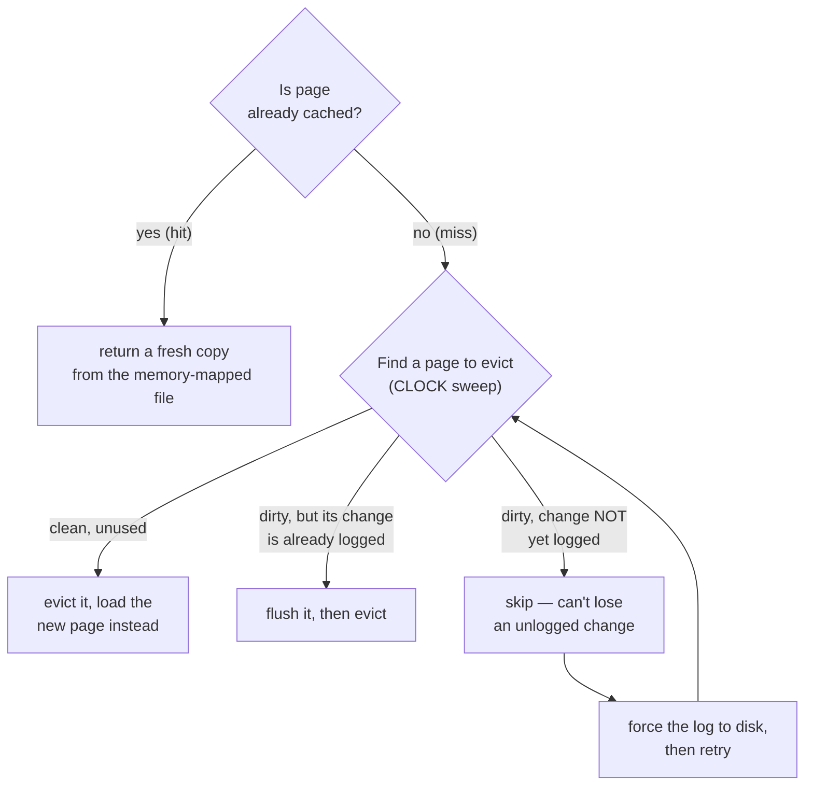
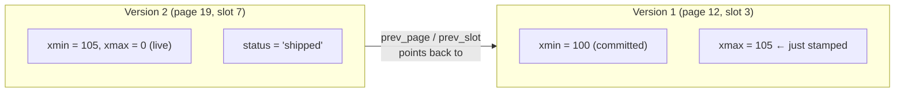
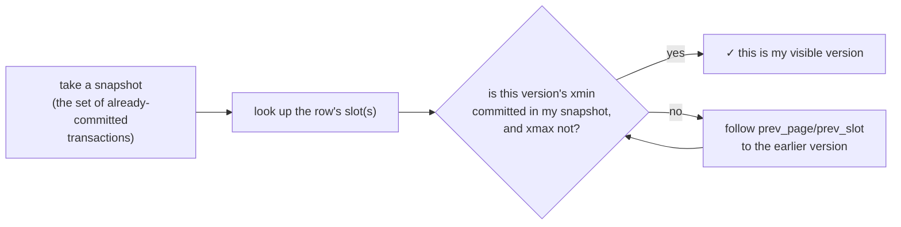
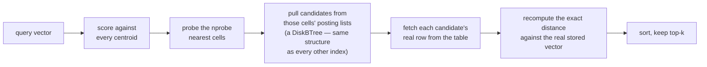
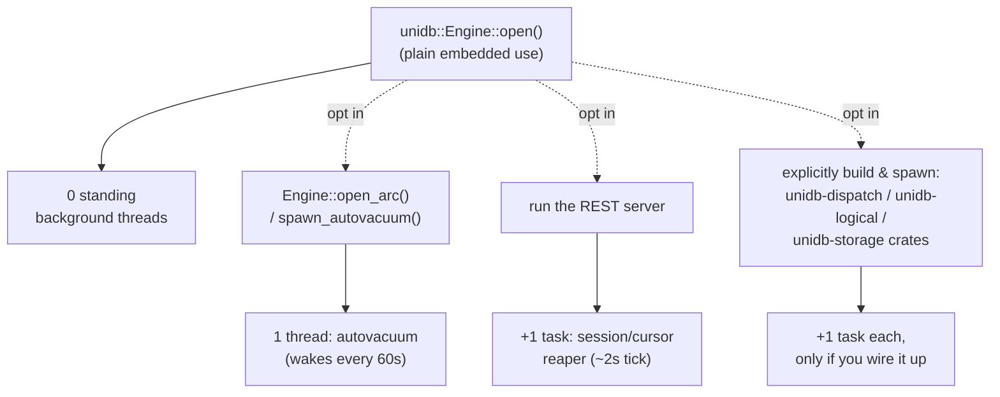
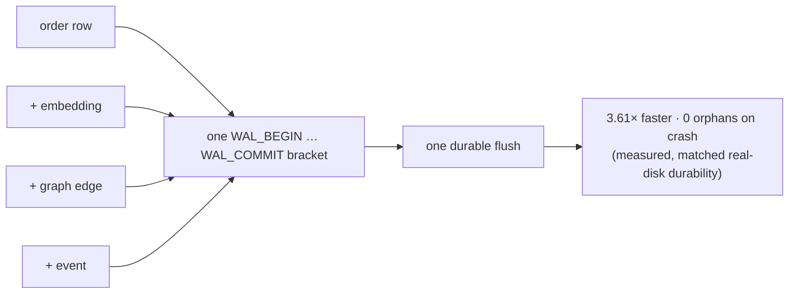

# Inside unidb: One Order, Start to Finish

> **Who this is for:** anyone — no prior database-internals knowledge
> required. Every term is defined the first time it's used. If you already
> know what a WAL or a buffer pool is, skim the diagrams and skip ahead.
>
> **What this is:** one order moving through the real engine, traced by
> actually reading the source (file/line citations throughout, so you can
> verify everything yourself and keep learning from the code). For the
> polished, internals-free version of this story, see
> [`unidb_engine_architecture.pdf`](unidb_engine_architecture.pdf). For the
> exhaustive engineering reference, see
> [`processing-engines/`](processing-engines/00_engines_index.md).

---

## The one idea this whole document proves

Most systems that do "SQL + vector search + graph + events" are really four
separate products glued together by your application code: Postgres, a
vector database, a graph database, a queue. Saving one order with its
embedding, a related graph edge, and an event means **four separate
commits** — and a crash between any two of them leaves a mess only your
application code can try to clean up.

unidb keeps all four in **one file, one log, one transaction manager**. This
document shows you the actual bytes that make that true.



Measured, at matched real-disk durability: unidb's one commit is **3.61×
faster** than the four-commit stack, and **0 orphaned records** on crash vs.
a torn record for the stitched stack. Every section below shows you the
mechanism that makes this true, one order at a time.

---

## The table we'll use everywhere

```sql
CREATE TABLE orders (
  id       INT PRIMARY KEY,
  customer TEXT,
  total    DECIMAL(10,2),
  status   TEXT
);
```

---

## 1. Where your schema lives

**In plain terms:** unidb doesn't have a separate "schema database." A table
definition — its column names and types — is stored durably the exact same
way your rows are: as data, on a page, protected by the same log.



**Under the hood.** The schema (`TableDef`/`ColumnDef`) is serialized as
JSON — the one deliberate exception to "no JSON on the hot path," since
schema changes are rare, not per-row (`src/catalog.rs`). For a table this
small it fits on one page: `[magic 0xC0DA7A10 : 4B][next_page_id (none) : 4B][JSON]`.
A bigger schema would chain across pages via `next_page_id` — see
[`processing-engines/02_storage_engine.md`](processing-engines/02_storage_engine.md).
The **control file** (below) points at this page via `catalog_root`, updated
only at the moment a schema change is fully durable — never partway through.

> **Why this beats the alternative.** In many systems, schema metadata and
> row data have genuinely different storage/backup/recovery paths. Here they
> share one recovery story, always — a crash mid-`CREATE TABLE` can't leave
> your catalog and your data file disagreeing about what exists.

---

## 2. Saving one order — byte by byte

**In plain terms:** "durable" doesn't mean a function returned successfully.
It means specific bytes reached disk, in a specific order, so that even a
power failure a millisecond later can't lose them.

```sql
INSERT INTO orders VALUES (1, 'Alice', 249.99, 'pending');
```

### The row, encoded

Every value is stored as `[tag byte][value bytes]`, concatenated column by
column — no separate schema lookup needed to decode it later (`src/sql/executor.rs`,
`encode_row`):

| Column | Value | Tag | Encoding | Bytes |
|---|---|---|---|---|
| `id` | `1` | 1 (Int64) | 8-byte little-endian integer | 9 |
| `customer` | `'Alice'` | 2 (Text) | 4-byte length + UTF-8 | 10 |
| `total` | `249.99` | 6 (Decimal) | 16-byte integer (`24999`) + 1-byte scale (`2`) | 18 |
| `status` | `'pending'` | 2 (Text) | 4-byte length + UTF-8 | 12 |
| | | | **Total row** | **49 bytes** |

`249.99` is never stored as a floating-point number — it's stored as the
exact integer `24999` plus "divide by 10²," so money never loses precision
to rounding. In hex, little-endian: `A7 61 00 00 00 00 00 00 00 00 00 00 00 00 00 00 02`.

### The row, placed on an 8 KiB page



The **24-byte version header** prepended to every stored row (`src/page.rs`)
records who wrote it and what came before it — this is the machinery
Section 4 uses:

| Field | Bytes | Meaning |
|---|---|---|
| `xmin` | 8 | the transaction that created this version |
| `xmax` | 8 | the transaction that replaced it (`0` = still live) |
| `prev_page` / `prev_slot` | 4 + 2 | where the previous version lives, if any |

**Stored cost of this one order: 73 bytes of tuple + 4 bytes of slot
pointer = 77 bytes**, out of an 8,192-byte page.

### What gets logged, in order



The `WAL_INSERT` record's payload is exactly `[xmin:8][prev_page:4][prev_slot:2][the 49-byte row]`
= 63 bytes — and it carries **no undo bytes at all**, because undoing an
insert is structurally simple: "this slot never happened."

> **Why this beats the alternative.** This is the actual mechanism behind
> the 3.61× number from the top of this document. Later sections show the
> same order gaining an embedding, a graph edge, and an event — and every one
> of those additions is *more WAL records appended to this same log*, inside
> the same `WAL_BEGIN`/`WAL_COMMIT` bracket. One flush to disk covers all of
> it. A stitched stack physically cannot do this — Postgres's log knows
> nothing about your vector database's log.

---

## 3. Getting your order back into memory

**In plain terms:** a database can't keep every page in RAM, so it needs a
rule for what to keep cached — and a rule that guarantees it never "forgets"
a change before that change is safely logged.



**Under the hood.** There's no separate RAM copy of every page sitting
around — the "buffer pool" (`src/bufferpool.rs`) is a lightweight tracking
table (which pages are pinned, dirty, recently used); the actual bytes live
in a memory-mapped view of the data file, and the OS handles the real
caching. Eviction uses the **CLOCK algorithm** (a low-overhead approximation
of "evict what hasn't been touched recently"). The one rule that's never
allowed to break: **a dirty page can't be evicted until its change is
durably logged.** Default cache size: 4,096 pages = 32 MiB.

> **Why this beats the alternative.** This rule (called write-ahead
> logging, enforced here at two separate checkpoints in the eviction code)
> is *why* a crash under memory pressure can't silently lose a committed
> change. When nothing is safely evictable, unidb forces the log to disk and
> retries — it never returns a "pool full" error to your application instead
> of just doing the safe thing.

---

## 4. Changing an order's status

```sql
UPDATE orders SET status = 'shipped' WHERE id = 1;
```

**In plain terms:** unidb never overwrites a row in place. It writes a
**new version** and marks the old one as superseded — which is why a report
reading this table and someone updating it can run at the exact same
instant without ever blocking each other.



**Under the hood.** Confirmed directly from `src/heap.rs`'s update path —
one transaction, two WAL records for the row itself:

| Order | Record | What it changes |
|---|---|---|
| 1 | `WAL_BEGIN` | starts the mini-transaction |
| 2 | `WAL_UPDATE` | stamps the **old** version's `xmax` (redo = 8 bytes, undo = 8 bytes so an abort can un-stamp it) |
| 3 | `WAL_INSERT` | writes the **new** version, `prev_page`/`prev_slot` pointing at the old one |
| 4 | `WAL_COMMIT` | done |

The code holds only **one page latch at a time** during this — the old
page's latch is released before the new page's latch is taken — specifically
so two concurrent updates can never deadlock on opposite lock ordering.

> **Why this beats the alternative.** This is MVCC (multi-version
> concurrency control): readers see a consistent snapshot without ever
> waiting on a writer, and writers never wait on readers. A `SUM(total)`
> report running right now sees a perfectly consistent view, whether or not
> this UPDATE has committed yet — no locks, no blocking, no torn reads.

---

## 5. Reading an order back

```sql
SELECT * FROM orders WHERE id = 1;
```

**In plain terms:** reading is "find the version of this row that existed
at the moment my query started, and nothing newer."



That's the whole read path — a snapshot check against the 24-byte version
header from Section 2, walking backward through `prev_page`/`prev_slot` only
if needed. The full isolation-level story (Read Committed / Repeatable Read
/ Serializable) is in
[`processing-engines/04_transaction_engine.md`](processing-engines/04_transaction_engine.md).

---

## 6. Finding similar orders — adding a vector column

```sql
ALTER TABLE orders ADD COLUMN embedding VECTOR(4);
```

**In plain terms:** "search by meaning" (find orders similar to this one)
needs a way to find nearby points in space without comparing your query
against every single row. That's what a vector index is for.



**Under the hood.** For `n` rows, the index picks `nlist = round(√n)`
(capped at 256) clusters, and probes `nprobe = max(nlist/8, 8)` of them per
query — illustrated:

| Rows | `nlist` | `nprobe` | What that means |
|---|---|---|---|
| 5 | 2 | 2 | every cell probed — effectively exact search on a tiny table |
| 100 | 10 | 8 | most cells probed |
| 10,000 | 100 | 12 | a small fraction probed — this is where the speedup matters |

**The single most important fact in this section:** despite this project's
dependency list including one third-party nearest-neighbor library, that
library is used *only* by a retired, disconnected benchmark baseline that no
query ever touches. The real, production vector index (`DiskIvfIndex`,
`src/disk_vector.rs`) is entirely hand-written Rust — including its own
clustering algorithm and distance math — and its posting lists are **the
exact same B-tree structure** that backs every ordinary secondary index and
full-text search. It was never built as a second database.

And however many cells get probed, the *ranking* is never approximate: every
candidate's distance is recomputed against its real, stored vector before
the top-k is chosen. Approximation only ever decides which cells to look at,
never which answer is correct.

> **Why this beats the alternative.** Bolting a real external vector
> database onto a relational engine means a second storage engine, a second
> crash-recovery story, and a real, ongoing risk that the two silently drift
> out of sync. Here, adding vector search cost the project **zero new
> crash-recovery code** — it reused the WAL, the buffer pool, and the B-tree
> that already existed. Add an embedding to `orders` and it becomes durable,
> crash-safe, and transactional the same instant the row itself does.

---

## 7. What's actually running in the background

**In plain terms:** a lot of database software runs continuous background
maintenance you never see. The honest question is: how much, and is any of
it running when you didn't ask for it?



**The honest answer, verified directly from the source, not assumed:**

| Worker | Exists when | What it does | How often |
|---|---|---|---|
| Autovacuum | you opt in (`open_arc`/`spawn_autovacuum`, or the REST server) | reclaims old row versions once nothing can see them anymore | wakes every 60s |
| Auto-checkpoint | always available | trims the log, saves a recovery point | checked inline on every commit — **not a thread at all** |
| Server session/cursor reaper | REST server only | cleans up abandoned connections | one combined task, ~2s |
| Realtime push, log rotation, replication fan-out, storage reconciliation | only if *you* build and start them | each does its own job | your call entirely — none self-start |
| The old async vector-rebuild worker | **retired — doesn't exist anymore** | — | — |

**A plain `unidb::Engine::open()` — no server, no extra crates — runs zero
standing background threads.** The old version of your order from Section 4
just sits on disk until you explicitly turn on cleanup.

> **Why this beats the alternative.** For an embedded or resource-constrained
> deployment, "nothing runs unless you ask for it" isn't a missing feature —
> it's the point. You get exactly the background work you opted into, and
> can see and name every thread that's running.

---

## 8. Bringing it together

One order moved through this document as: a schema (§1), a durable insert
(§2), a page pulled through the buffer pool (§3), a versioned update (§4), a
consistent read (§5), a searchable embedding (§6) — and none of it required a
background worker you didn't ask for (§7).

The thesis from the top of this document is the same fact, restated now that
you've seen the mechanism: **one WAL, one buffer pool, one transaction
manager, reused — never duplicated — for rows, vectors, graph edges, and
events.** That's not a marketing claim; it's the literal reason a
multi-model commit costs one log flush instead of four, and the literal
reason a crash leaves zero orphaned records instead of a torn one.



**The honest boundary:** unidb is a single-primary engine (read replicas,
not distributed multi-writer), and it isn't trying to out-Postgres Postgres
on a plain single-table CRUD benchmark — on that narrow workload a
specialized incumbent can still win. The advantage this document walked
through is specific and real: the moment your application needs more than
one data model in one transaction, there is structurally nothing to keep in
sync, because there was never more than one system.

---

## Where to go deeper

| This section | Read next |
|---|---|
| §1 Catalog | [`processing-engines/02_storage_engine.md`](processing-engines/02_storage_engine.md) |
| §2 WAL / durability | [`processing-engines/03_wal_and_recovery.md`](processing-engines/03_wal_and_recovery.md) |
| §3 Buffer pool | [`processing-engines/02_storage_engine.md`](processing-engines/02_storage_engine.md) |
| §4/§5 MVCC, isolation | [`processing-engines/04_transaction_engine.md`](processing-engines/04_transaction_engine.md) |
| §6 Vector search | [`processing-engines/07_vector_engine.md`](processing-engines/07_vector_engine.md) |
| §7 Background workers | [`processing-engines/04_transaction_engine.md`](processing-engines/04_transaction_engine.md) (vacuum), [`processing-engines/11_server_replication_operations.md`](processing-engines/11_server_replication_operations.md) (server) |
| Everything, exhaustively | [`engine_design.md`](engine_design.md) |
| The polished, end-user version | [`unidb_engine_architecture.pdf`](unidb_engine_architecture.pdf) |
