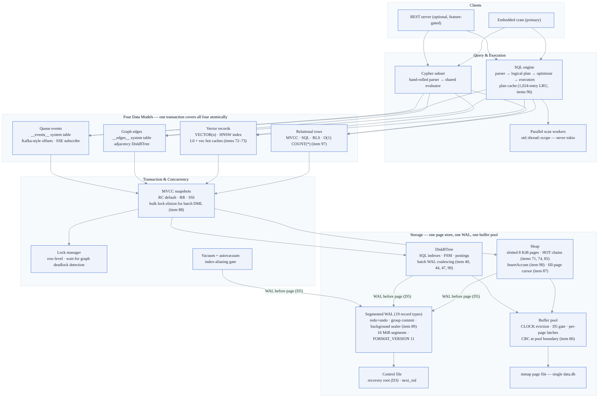

# unidb — Processing Engines: Reference Documentation

> A technical reference for every processing engine in unidb. Written from the
> shipped code; when this collection and `CLAUDE.md`/`PROGRESS.md` disagree,
> those win.
>
> Mermaid diagrams are rendered natively by GitHub.

**Engine state:** `FORMAT_VERSION` 11 · crash harness 51 points · all four data
models shipped · items 71–99 incorporated.

---

## System architecture

---

## The competitive thesis

unidb's moat is **eliminating the multi-system dual-write tax**: "save row +
embedding + graph edge + event" is one WAL append chain and one group-committed
fsync, versus 3–4 network round-trips with no shared transaction across
Postgres + vector store + graph DB + Kafka.

This is a workload-specific claim (`CLAUDE.md §6`). The benchmark philosophy
compares against the *replaced stack* for cross-domain workloads, and against
SQLite (the honest embedded analog) for single-model CRUD. Single-model
comparisons against specialized incumbents report losses honestly.

---

## Document index

| # | Document | What it covers |
|---|----------|----------------|
| 1 | [Architecture overview](01_architecture_overview.md) | Layer stack, one-commit multi-model flow, data structures by level, trust model |
| 2 | [Storage engine](02_storage_engine.md) | Page layout, HOT chains (same-page + cross-page), InsertAccum, buffer pool, heap, checkpoint |
| 3 | [WAL & crash recovery](03_wal_and_recovery.md) | All 19 WAL record types, FORMAT_VERSION history, mini-transactions, ARIES redo/undo, 51-point crash matrix |
| 4 | [Transaction engine](04_transaction_engine.md) | MVCC snapshots, isolation levels (RC/RR/SSI), lock manager, vacuum, bulk lock elision |
| 5 | [SQL query engine](05_sql_query_engine.md) | Parse → plan → execute, plan cache (item 96), O(1) COUNT(*) (item 97), batch INSERT (item 98), GROUP BY pushdown |
| 6 | [Indexing engines](06_indexing_engines.md) | DiskBTree node format, latch-crabbing, WAL coalescing, sort-then-bulk-load (item 40) |
| 7 | [Vector engine](07_vector_engine.md) | HNSW structure, L0/vec hot caches (items 72–73), beam search, SIMD distance (item 92), NodeCache gate (item 65) |
| 8 | [Graph engine](08_graph_engine.md) | Edge storage, adjacency index, Cypher subset, CSR post-mortem |
| 9 | [Event queue engine](09_event_queue_engine.md) | Synchronous transactional capture, Kafka-style offsets, SSE subscribe, slow-consumer contract |
| 10 | [Parallelism & performance](10_parallelism_and_performance.md) | Group commit, parallel scan workers, partial aggregates, full benchmark results (Tables 1–5) |
| 11 | [Server, replication & operations](11_server_replication_operations.md) | All REST routes, POST /batch-sql (item 99), POST /bulk (item 32), CDC management (item 33), JWT/roles, WAL shipping, PITR |
| 12 | [Future roadmap](12_future_roadmap.md) | Filed follow-ups organized into proposed phases with exit criteria |

---

## How to read this collection

- **New to the codebase?** Read docs 1 → 2 → 3 → 4 in order. Everything else
  sits on the storage/WAL/MVCC triad.
- **Auditing a durability claim?** Docs 2 + 3 and the crash matrix in doc 3.
- **Evaluating the multi-model thesis?** Doc 1, then the benchmark tables in
  doc 10 and `PROGRESS.md`.
- **Planning future work?** Doc 12 cross-referenced against
  `docs/backlog/backlog_index.md`.

## Conventions

- **Locked decisions** cited as `D1`–`D13` (see `CLAUDE.md §3`).
- Code references are `file.rs` paths relative to `src/` unless noted.
- All on-disk integers are little-endian (D9); "page" means the 8 KiB (D8)
  unit unless stated otherwise.
- Performance numbers come from `PROGRESS.md` and the shipped benchmark runs.
  They are never invented.
