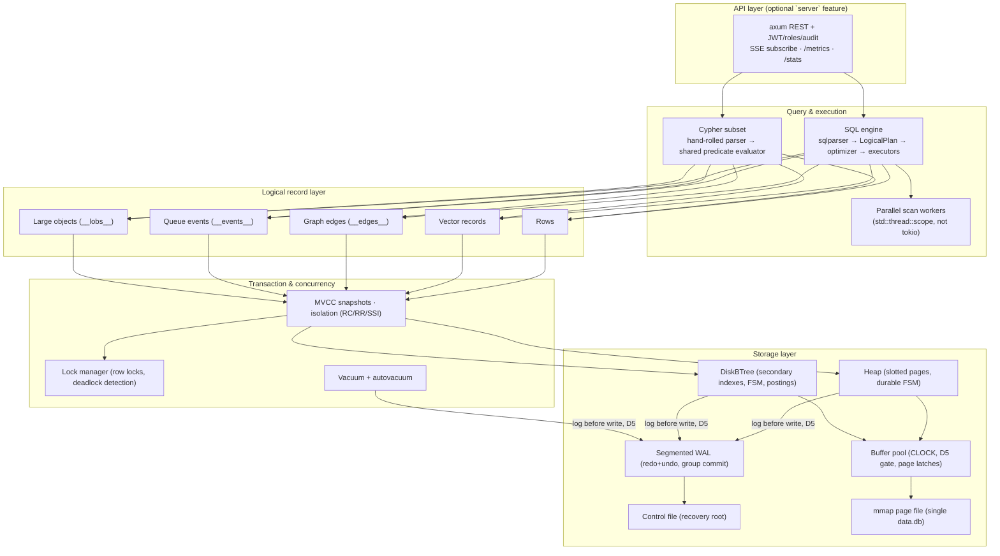
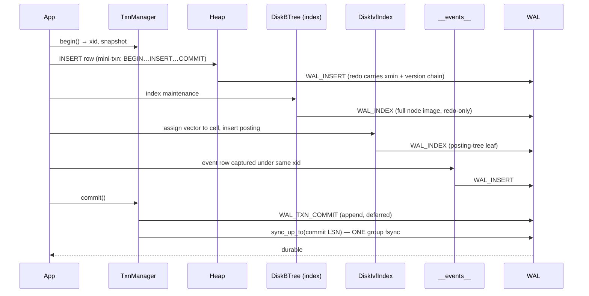

# 1. Architecture Overview

**Audience:** anyone touching unidb internals. **Prerequisites:** none.

unidb is a single embedded storage/transaction engine in Rust that unifies four
data models — relational CRUD, vector search, graph edges, and a durable event
queue — over **one page store, one WAL, one buffer pool, one transaction
manager**. A single transaction can touch all four atomically because there is
one node and one log.

The competitive thesis is **eliminating the multi-system dual-write tax**:
"save row + embedding + graph edge + event" is *one* WAL append chain and *one*
group-committed fsync here, versus 3–4 network round-trips with no shared
transaction across Postgres + a vector store + a graph DB + Kafka.

---

## 1.1 Layer stack

The embedded crate is primary; the REST server is an optional feature. The
default (non-`server`) build has **zero async dependencies** — the engine core is
fully synchronous (`cargo tree -p unidb --no-default-features` is verified free
of tokio/reqwest/axum).

## 1.2 Processing-engine inventory

| Engine | Module(s) | Core data structure | Durability mechanism | Doc |
|---|---|---|---|---|
| Storage / heap | `page.rs`, `bufferpool.rs`, `heap.rs`, `mmap.rs` | Slotted 8 KiB pages, CLOCK frame table, DiskBTree FSM | WAL-before-page (D5) + FPI | [2](02_storage_engine.md) |
| WAL & recovery | `wal.rs`, `recovery.rs`, `checkpoint.rs`, `control.rs` | 16 MiB segment files, 41-byte record header | fsync (group-committed), CRC32 everywhere | [3](03_wal_and_recovery.md) |
| Transactions | `txn.rs`, `mvcc.rs`, `lockmgr.rs` | `Snapshot{xmin,xmax,active}`, wait-for graph | undo log + `WAL_TXN_*` records | [4](04_transaction_engine.md) |
| SQL | `sql/*` | `LogicalPlan` / `QuerySpec` / `PlanNode` trees | n/a (reads); statements are mini-txns | [5](05_sql_query_engine.md) |
| B-Tree / full-text | `btree_index.rs`, `fulltext.rs` | Right-linked B-tree over standard pages | redo-only `WAL_INDEX` full-page images | [6](06_indexing_engines.md) |
| Vector | `disk_vector.rs` (prod), `vector.rs` (retired) | IVF-Flat: centroid pages + DiskBTree postings | same `WAL_INDEX` machinery | [7](07_vector_engine.md) |
| Graph | `graph/*` | `__edges__` heap table + adjacency DiskBTree | ordinary row WAL + `WAL_INDEX` | [8](08_graph_engine.md) |
| Event queue | `queue/*` | `__events__` + `__consumers__` heap tables | ordinary row WAL, txn-atomic | [9](09_event_queue_engine.md) |
| Parallel scan | `sql/parallel_scan.rs` | Atomic page-cursor work stealing | read-only | [10](10_parallelism_and_performance.md) |
| Server / HA | `server/*`, `replication/*`, `backup/*` | slot registry, framed WAL stream | WAL shipping capped at durable LSN | [11](11_server_replication_operations.md) |

**The recurring architectural move is durability reuse.** Vector postings, graph
adjacency, full-text postings, LOB directories, and the heap's free-space map are
*all the same `DiskBTree`*; edges, events, consumer offsets, and LOB chunks are
*all ordinary rows* in synthetic `__…__` system tables. Each new model therefore
inherits WAL logging, crash recovery, MVCC, vacuum, and replication for free —
one crash-recovery code path covers five engines.

## 1.3 One commit, four models — the headline flow

Under the commit-time-fsync default (ARIES force-log-at-commit), all the
statement mini-txns append without individual fsyncs; the single
`sync_up_to` at user-commit is the one durable point, and concurrent committers
coalesce behind one `fsync` (leader election). This took the full multi-model
commit from ~33.1 ms (≈10 F_FULLFSYNCs) to **~4.40 ms** — with the plain-row rung
at SQLite parity (3.59 ms vs 3.64 ms at matched durability).

## 1.4 Data structures by level

| Level | Structure | Shape | Why this shape |
|---|---|---|---|
| Byte | Page | 28 B header (id, type, **CRC32**, **LSN**, slot count, free bounds) + slot array ↑ + tuple data ↓ | CRC detects torn writes; LSN gates redo idempotence and D5 |
| Tuple | Tuple header | 24 B: `xmin`, `xmax`, `prev_page`, `prev_slot` | MVCC visibility + backward version chain, no separate undo segment |
| File | `data.db` | Single file, grown in 4 MiB chunks, mmap'ed | One remap per chunk (was O(N²) whole-file remaps); OS page cache = read cache |
| Cache | Buffer pool | `Frame{pin, dirty, clock_ref}` metadata only; bytes live in the mmap | mmap-as-storage: readers copy pages out under a `RwLock`, no second cache |
| Free space | Durable FSM | DiskBTree `page_id → free_bytes` per table | O(1) engine open, O(log n) append-tail lookup; killed the catalog-blob overflow |
| Log | WAL record | 41 B header + redo + undo + CRC32, framed `[len][record]` in 16 MiB segments | steal/no-force (D1) needs redo+undo; segments make truncation = file deletion |
| Txn | Snapshot | `{xmin, xmax, frozen active set}` | RC = new snapshot per statement; RR/SSI = per txn; same visibility code |
| Index | DiskBTree node | meta / internal / leaf pages, right-linked leaves | latch-free reads; full-page redo-only WAL; stable meta page id = no rebuild on open |
| Vector | IVF-Flat | centroid chain (flat f32 table) + postings DiskBTree | posting list *is* a BTree run — pages cleanly, unlike an HNSW graph |
| Graph | `__edges__` rows + adjacency BTree | `(from_id, to_id, edge_type, props)` | full MVCC/SQL for free; index is a hint, MVCC re-validates |
| Events | `__events__` rows | `(seq, xid, table, op, payload JSON)` | event fate tied to writer's txn — zero new abort-path code |

## 1.5 Trust and failure model

- **Every page read is CRC-checked** (all-zero fresh pages excepted); every WAL
  record is CRC-checked; the control file is CRC-checked and is the single
  source of recovery truth (D3).
- **D5 — WAL-before-page** is *the* invariant: no dirty page may be flushed or
  evicted while `page.LSN > durable_WAL_LSN`. It is enforced at the eviction
  gate, re-checked at flush, and guarded by a `debug_assert!` tripwire — a tested
  invariant, not folklore.
- **fsync failure is fatal for the session** (fsyncgate, P1.b): a failed
  `fsync`/`msync` poisons the WAL/buffer pool permanently and every later
  durability call returns `DurabilityFailure`. The remedy is restart + recovery,
  never an in-session retry that could falsely succeed.
- **Secondary indexes are hints, not truth.** Every index read (B-tree, vector,
  full-text, adjacency) re-validates candidates against the caller's MVCC
  snapshot. Stale entries are harmless; missing entries are prevented by
  WAL-ordering; slot reuse is gated by vacuum's index scrub (the aliasing gate).
- **Crash-injection harness (D7)** currently covers **29 kill points** plus a
  randomized property test, run under both durability policies. See doc 3 §6.

## 1.6 Scope discipline (non-goals)

Single-primary only (no distributed consensus); practical SQL subset (not full
ANSI); no cloud control plane. Every generalization costs throughput a
specialized engine wouldn't pay — when in doubt, unidb keeps it specialized and
simple, and benchmarks honestly against the *replaced stack*, not one incumbent
on its home turf (`CLAUDE.md §6`).
