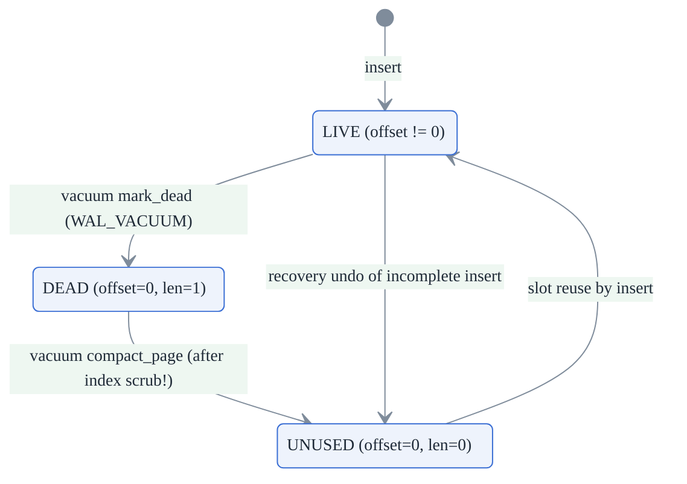
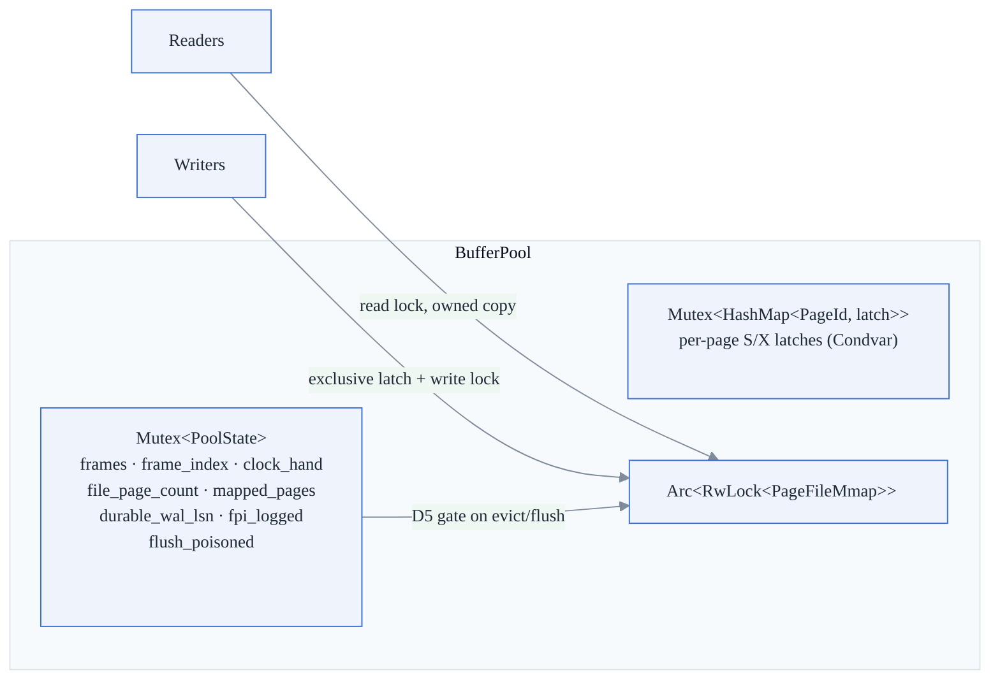
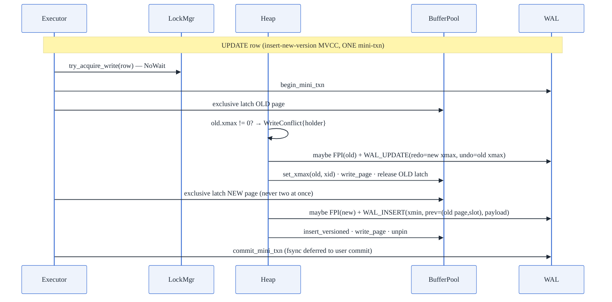
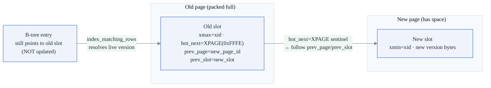

# 2. Storage Engine — Pages, Buffer Pool, Heap, HOT Chains, InsertAccum

**Modules:** `format.rs`, `page.rs`, `mmap.rs`, `bufferpool.rs`, `control.rs`,
`heap.rs`, `checkpoint.rs`, `large_object.rs`.
**Locked decisions:** D3 (control file), D4 (tuple header), D5 (WAL-before-page),
D6 (single file), D8 (8 KiB pages), D9 (little-endian + CRC + LSN).

> **Note:** `FORMAT_VERSION` is now **11**. The version history embedded in
> `format.rs` explains every bump — each one was mandatory to prevent older
> binaries from silently misrecovering.

---

## 2.1 On-disk formats

### Constants (`format.rs`)

| Constant | Value | Notes |
|---|---|---|
| `MAGIC` | `0x556E4442` ("UnDB") | control file |
| `FORMAT_VERSION` | `11` | v9: cross-page HOT (item 71) · v10: reserved · v11: `row_count` in catalog (item 97) |
| `DEFAULT_PAGE_SIZE` | 8192 | power-of-two, 4 KiB–64 KiB allowed, baked into control file |
| `INVALID_PAGE_ID` | `u32::MAX` | page 0 is allocatable — the sentinel is MAX, not 0 |
| `INVALID_LSN` / `INVALID_XID` | 0 | |
| Page types | HEAP=1, FREE=2, META=3, BTREE=4 | |
| `HOT_NEXT_XPAGE` | `0xFFFE` | sentinel in `hot_next` field signalling cross-page HOT chain |

### Page layout (28-byte header + slotted body)

```
offset  field        type  meaning
[0..4]   page_id     u32
[4]      page_type   u8
[5..8]   padding
[8..12]  crc32       u32   over the whole page with this field zeroed
[12..20] lsn         u64   LSN of the last WAL record applied to this page
[20..22] slot_count  u16
[22..24] free_start  u16   first free byte after the slot array
[24..26] free_end    u16   first byte of the highest-offset tuple
[26..28] padding
--- slot array grows UP from 28: (offset u16, length u16) per slot ---
--- tuple data grows DOWN from the page top ---
```

### Tuple header (24 bytes, prepended to every stored record — D4)

```
[0..8]   xmin      u64   inserting txn
[8..16]  xmax      u64   deleting/superseding txn; 0 = live
[16..20] prev_page u32   previous version's page (backward chain)
[20..22] prev_slot u16
[22..24] padding
```

### Slot lifecycle (M10) — encoded in the existing 4-byte slot, **no format change**



`SLOT_DEAD_LEN = 1` can never collide with a live tuple: a real stored length is
always ≥ 24 (the tuple header). DEAD slots are deliberately **not** reusable —
a secondary index may still hold `(page, slot)`; only after vacuum's index-scrub
pass does `compact` promote DEAD → UNUSED. This is the storage half of the
index-aliasing gate (doc 4 §4.4).

## 2.2 mmap-as-storage (`mmap.rs`)

The single `data.db` is memory-mapped (`memmap2::MmapMut`). This is the **only
module permitted `unsafe`**, with the safety invariant documented: the buffer
pool holds the only `File` handle for the map's lifetime and the file is at
least one page before mapping.

Consequences that shape everything above it:

- `write_page` mutates bytes **directly in the mmap** under its write lock;
  a reader (`SharedPageReader` or the pool) takes an **owned copy** under the
  read lock. There is no frame data buffer and therefore no "pool newer than
  disk image" divergence — this is what later made parallel scan trivial to make
  correct (doc 10 §2).
- `flush_range` = `msync`. An `msync` error is a durability failure (fsyncgate):
  the OS may have dropped the dirty page *and* cleared its dirty bit, so a retry
  can falsely succeed — the pool poisons itself instead (§2.3).
- The OS page cache is the read cache; no user-space cache duplicates it.

## 2.3 Buffer pool (`bufferpool.rs`)



Key structures:

- `Frame { page_id, pin_count, dirty, clock_ref }` — **eviction metadata only**;
  page bytes live in the mmap.
- `PoolState.durable_wal_lsn` — the D5 frontier. Stale-low is always safe (it
  only makes a page temporarily un-evictable), never unsafe.
- `fpi_logged: HashSet<PageId>` — "already has a full-page image this checkpoint
  interval". Keyed by page id (not frame) so it survives eviction: **exactly one
  FPI per page per interval**.
- Hand-rolled per-page reader/writer latches (`LatchState{readers, writer}` +
  `Condvar`, RAII guards). A latch orders *physical* access to one page, is held
  only for the duration of a page access — never across an fsync or a user
  transaction — and is orthogonal to logical row locks.

### Eviction — CLOCK with the D5 gate

`find_victim` loops the clock hand (≤ 2 × capacity):

1. pinned → skip; `clock_ref` set → clear it, skip (second chance);
2. dirty → **D5 gate**: skip if `durable_wal_lsn == INVALID_LSN` or
   `page_lsn > durable_wal_lsn` (a `debug_assert!` tripwire guards the steal
   point); otherwise flush it in place;
3. return the frame; loop exhausted → `BufferPoolFull`.

`fetch_page_for_write` handles the deferred-fsync case where the pool fills with
not-yet-durable dirty pages: on `BufferPoolFull` it forces **one `wal.sync()`**
(ARIES "force the log before stealing the page") and retries once. Crash point
Pd proves the ordering survives a crash.

### Flush path & fsync poisoning (P1.b)

`flush_page` re-checks D5 (authoritative enforcement), then `msync`s the range.
On failure — injected or real — it sets `flush_poisoned`, **leaves the frame
dirty**, and returns `DurabilityFailure`; every later flush fails too. Crash
point P12 asserts the engine refuses to report success after an fsync failure.

### File growth

`ensure_mapped` grows `data.db` in **4 MiB chunks** and re-creates the mmap under
the write lock — one remap per chunk instead of per page (P1.c fixed the O(N²)
whole-file remap). At open, `logical_page_count` scans backward over trailing
all-zero pages so a previous session's pre-grown slack is reused, not leaked.

## 2.4 Heap (`heap.rs`)

`Heap { page_size, fsm: Mutex<HeapFsm>, fsm_tree: Option<DiskBTree> }` —
`RowId{page_id, slot}` names one physical tuple *version* (not a stable logical
id; a superseded version's RowId stops resolving).

### Durable free-space map — the O(1)-open moat

The per-table page directory + free-space map is a `DiskBTree` keyed
`page_id → free_bytes` (the value rides in the entry's `RowId.slot` field, valid
because free bytes < page size ≤ `u16::MAX`). The meta page id lives in
`TableDef.fsm_meta`.

- `Heap::open` is **O(1)** — a DiskBTree handle is just (meta page id, page
  size). No directory scan, no rebuild.
- The **insert path never loads the full directory**: it probes cached pages,
  then the durable append tail via `max_entry` (one O(log n) descent to the
  rightmost leaf). Only full scans and vacuum lazily load the whole directory
  (`ensure_directory`), and those are O(pages) anyway.
- The in-memory `free_map` is a **hint that never over-reports**;
  `acquire_page_for_insert` re-checks free space under the page latch and
  retries, so a stale-high hint costs a retry, never a corruption.
- History: before this, `TableDef.pages` lived inline in the single JSON catalog
  blob and was rewritten on every page allocation; at ~1,450 pages the blob
  overflowed one 8 KiB page and INSERT died with `HeapFull{8138}` (~145 k-row
  ceiling). The durable FSM removed both the ceiling and the O(pages)
  per-allocation rewrite (measured: insert cost flat ~17–28 µs/row vs rising
  65→173 µs then erroring).

### Atomic heap grow (crash point P28)

`alloc_heap_page` brackets the new page's init record **and** its FSM directory
entry in **one mini-txn**, so recovery replays both or neither — a crash mid-grow
can never orphan a page that its directory doesn't know about.

### CRUD flows



- **INSERT**: find/alloc page → latch → FPI-if-first-this-interval →
  `insert_versioned` → `WAL_INSERT` → `set_lsn` → `write_page` → record free
  space *after* dropping the latch.
- **DELETE**: xmax stamp only (`WAL_UPDATE` shape); physical removal is vacuum's
  job.
- **Undo primitives**: `undo_xmax_stamp` (revert to live) and `undo_insert`
  (self-stamp `xmax = own xid`, permanently invisible — reuses `is_visible`
  instead of inventing an "aborted" tuple state).
- **Reads**: `get_visible` (MVCC), `count_visible` (headers only — no body
  decode; powers the fast `COUNT(*)`), `scan_page_into` (owned page copies),
  with `query_limits::check()` every 256 pages for timeout/cancellation.

### HOT update chains (items 71, 74, 85)

Insert-new-version MVCC requires a B-tree update on every UPDATE when an indexed
column is in the SET clause. For non-indexed column updates ("HOT-eligible"), the
B-tree can be skipped if the chain is resolvable from the old slot.

**Same-page HOT (item 58):** When a page has space, the new version is inserted
on the *same page*; `hot_next` in the old slot's tuple header points forward to
the new slot. Readers follow the chain; the B-tree entry remains unchanged.

**Cross-page HOT (item 71):** When a page is full but the update is HOT-eligible:



The `prev_page`/`prev_slot` fields in a superseded tuple header are safe to
repurpose — backward-chain navigation only reads them on the *live* version, not
the old one. The sentinel `HOT_NEXT_XPAGE = 0xFFFE` distinguishes cross-page
chains from same-page chains (`hot_next` holds the slot offset otherwise).

**Batch HOT update (`hot_update_many`, item 74) — Phase A→B→C ordering:**

Phase ordering matters for crash safety. The correct order is:

1. **Phase A (`WAL_XMAX_BATCH`)** — per old-page group: acquire latch, conflict-
   check (`xmax == 0`), stamp xmax, commit mini-txn. Crash here: no new versions
   exist, so MVCC correctly shows the old versions.
2. **Phase B (`WAL_INSERT_BATCH`)** — insert new row versions on fill pages.
   Crash after Phase A + Phase B but before Phase C: new versions have
   `xmin = uncommitted xid` → invisible. Old versions xmax'd → also invisible.
   Correct: the uncommitted transaction leaves no trace after recovery.
3. **Phase C (`WAL_HOT_XPAGE_BATCH`)** — write forward chain pointers
   (`set_hot_xpage`) on old slots. Crash recovery undoes Phase A + Phase C
   (restores xmax=0, clears chain pointer), self-stamps Phase B tuples dead.

The B→A order shipped in item 74 was a bug (item 85): Phase A failing after
Phase B committed left orphaned new versions with no undo record. The A→B→C
reorder makes failure modes correct at every phase boundary.

### Fill-page cursor (item 87)

`INSERT` used to re-probe the FSM on every row to find a page with space. Under
a multi-row VALUES insert, this repeated the same O(log n) FSM lookup N times,
returning the same page each time. The fill-page cursor tracks the current open
page across rows within the same statement, re-probing only when the page fills.
This is a statement-scoped optimization — it does not persist across transactions.

### InsertAccum — streaming WAL batching for bulk INSERT (item 98)

A multi-row `INSERT ... VALUES (r1), (r2), ..., (rN)` writes all rows to the
heap, but the WAL overhead can dominate at large N: each page transition
previously emitted a `WAL_BEGIN`/`WAL_COMMIT` bracket.

`InsertAccum` accumulates rows into a page, flushing only when the page fills:

```
struct InsertAccum {
    page_id:    PageId,      // current open page
    mini_txn:   MiniTxnId,   // open WAL bracket for this page
    row_count:  usize,       // rows accumulated on this page
}
```

`Heap::insert_accumulating` writes each row under the open page's bracket.
`Heap::flush_insert_accum` closes the final page's bracket after the last row.
The result: **one `WAL_BEGIN`/`WAL_COMMIT` pair per heap page** across N rows,
not one per row. UNIQUE constraint enforcement runs per-row before the row is
written, so correctness is unaffected.

### Lock-ordering rules (why this can't deadlock)

1. The FSM mutex is held only for brief in-memory decisions — **never across a
   page-latch acquisition, WAL I/O, or FSM-tree I/O**. Ordering is latch → FSM,
   never FSM → latch.
2. UPDATE holds **at most one page latch at a time** (old released before new
   acquired, except in Phase B of hot_update_many where multiple fill pages may
   be held — each separately committed before the next is acquired).
3. Cross-page HOT latch ordering: new page acquired (Phase B), released, then old
   page acquired (Phase A/C). No path holds both simultaneously — no deadlock.
4. Page latches are never held across an fsync or a user transaction, so they
   cannot join a logical-lock cycle. Row-lock deadlocks are the lock manager's
   problem (doc 4 §3), detected on a wait-for graph.

## 2.5 Checkpoint (`checkpoint.rs`)

Strictly ordered; the control mutex is never held across an fsync:

1. `wal.sync()` — standalone durability so D5 lets every dirty page flush;
2. `pool.flush_all(durable_lsn)`;
3. `clear_fpi_tracking()` — next modification of each page opens a new FPI
   interval;
4. `wal.log_checkpoint()` (fsynced);
5. control-file update (checkpoint LSN, WAL tail, **`next_xid` captured before
   truncation** — see doc 3 §4 for the xid-reuse bug this fixes);
6. `truncate_before(min(checkpoint_lsn, replication retain floor))`.

Auto-checkpoint (P1.e) fires on time (default 60 s) or WAL size (default
64 MiB), but **only at a quiescent point** (`active_count() == 0`) so truncation
can never discard an in-flight transaction's undo records.

## 2.6 Large objects (`large_object.rs`, P3.d)

Multi-GB values are stored out-of-line, chunked, and streamed:

- `__lobs__(lob_id, chunk_no, data BYTEA)` — ordinary MVCC/WAL rows;
  `CHUNK_SIZE = 7000` bytes so a chunk row always fits a fresh 8 KiB page after
  headers and framing.
- A `DiskBTree` on `lob_id` maps blob → chunk RowIds: open/read is
  O(chunks-of-this-blob), not O(all blobs).
- `write_stream` / `read_stream` keep exactly **one chunk resident** — the only
  whole-blob-sized allocation is the 6-byte-per-chunk RowId list.
- Chunks are written under the **caller's xid**, so a blob commits or aborts
  atomically with its owning row — zero new transaction machinery. Crash point
  P16 proves a committed multi-chunk blob streams back byte-for-byte after a
  crash.

## 2.7 Border cases

| Case | Handling |
|---|---|
| Torn 8 KiB page (crash mid-write) | CRC detects; `WAL_FPI` clean image restores, higher-LSN redo replays on top (P11) |
| CRC mismatch on read | `ChecksumMismatch{page_id}`; all-zero (fresh) pages legitimately skip CRC |
| fsync/msync failure | Pool/WAL poison latches; permanent `DurabilityFailure`; frame stays dirty (P12) |
| Pool full of non-durable dirty pages | One forced `wal.sync()` + retry at the steal point (Pd) |
| Crash mid-heap-grow | Page init + FSM entry in one mini-txn — both or neither (P28) |
| Crash before FSM free-space update commits | Value is stale-**low** → safe under-report, corrected at next alloc/vacuum |
| Stale-high in-memory free hint | Re-check under page latch + retry loop |
| Legacy pre-FSM table (`fsm_meta == None`) | Falls back to the in-catalog `pages` list; no data-dir migration required |
| Trailing pre-grown zero pages after reopen | `logical_page_count` backward scan reclaims the slack |
| Recovery into a smaller file than the log implies | `ensure_page_allocated` grows file/mapping without pinning (fresh replica case) |
| Same-page concurrent writers | Exclusive page latch spans the whole read-modify-write — no lost updates |
| `HeapFull` | Returned per-insert when `needed > free_space`; the *catalog-blob* HeapFull ceiling is gone (durable FSM) |

## 2.8 Metrics hooks

- `Engine::wal_total_bytes_appended` (cumulative, survives truncation) and
  `rows_decoded_total` — the C1 instrumentation used to measure the Phase-A/B
  wins (doc 10).
- `EngineStats`/`/stats`: `data_pages`, dead/live tuple estimates, checkpoint
  counters (doc 11 §4).
