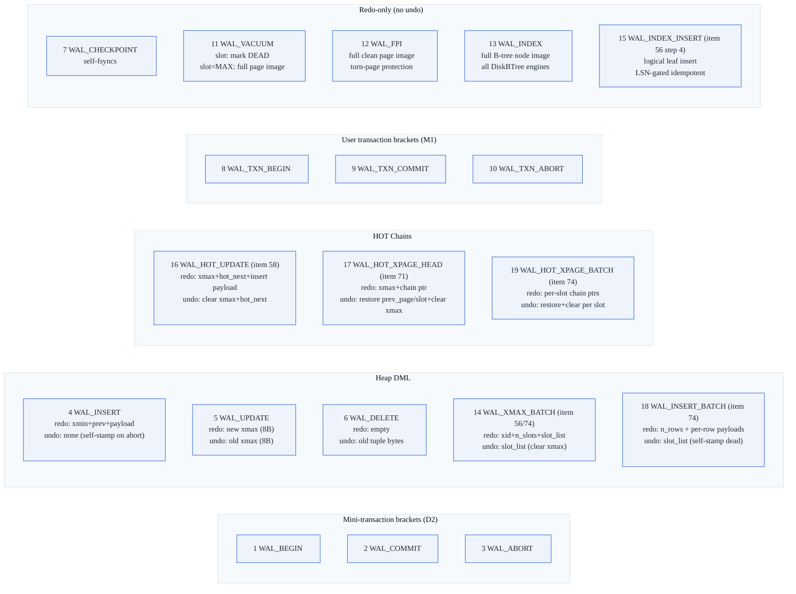
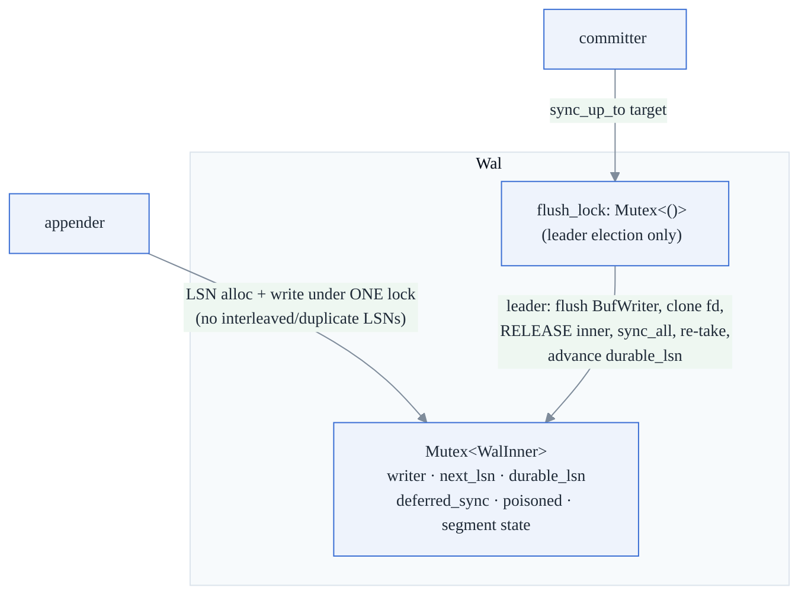
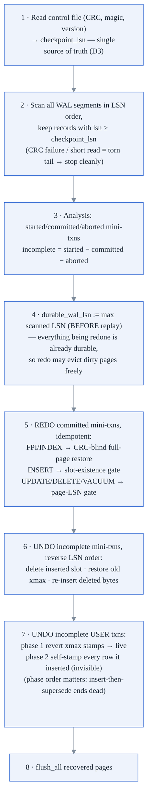

# 3. WAL & Crash Recovery

**Modules:** `wal.rs`, `recovery.rs`, `checkpoint.rs` (+ `bufferpool.rs` D5
hooks). **Locked decisions:** D1 (steal + no-force ⇒ redo **and** undo), D2
(statement = mini-transaction), D5 (WAL-before-page), D7 (crash harness), D9
(little-endian, CRC).

> **Note:** The WAL now defines **19 record types** (types 1–19). Every new type
> triggered a `FORMAT_VERSION` bump, which causes older binaries to produce a
> hard `BadVersion` error rather than silently misrecovering via the `_ => {}`
> catch-all. See `format.rs` for the full version history.

---

## 3.1 Record wire format

`FIXED_HDR = 41` bytes; total record = `41 + redo_len + undo_len + 4`:

```
[0..8]   lsn          u64   monotonic, 1-based (0 = INVALID)
[8..16]  prev_lsn     u64   previous LSN in the same mini-txn (chain)
[16..24] mini_txn_id  u64   doubles as xid for WAL_TXN_* records
[24]     rec_type     u8
[25..27] padding
[27..31] page_id      u32   0 for control records
[31..33] slot         u16   u16::MAX = whole-page record
[33..37] redo_len     u32
[37..41] undo_len     u32
[41..]   redo bytes, then undo bytes
[last 4] crc32        u32   over everything before it
```

Records are framed `[len:u32][record]` inside segments; the replication stream
uses the identical framing (doc 11 §5).

### Record kinds — all 19 types



| Type | # | Redo | Undo | Notes |
|---|---|---|---|---|
| `WAL_BEGIN` / `WAL_COMMIT` / `WAL_ABORT` | 1/2/3 | – | – | Mini-txn bracket (D2) |
| `WAL_INSERT` | 4 | xmin + prev + payload | – | `slot=u16::MAX` = page-allocation record |
| `WAL_UPDATE` | 5 | new xmax (8 B) | old xmax (8 B) | Post-M1: only used for individual xmax stamps |
| `WAL_DELETE` | 6 | empty | old tuple bytes | Undo re-inserts the deleted bytes |
| `WAL_CHECKPOINT` | 7 | – | – | Redo-only; self-fsyncs |
| `WAL_TXN_BEGIN/COMMIT/ABORT` | 8/9/10 | – | – | User transaction brackets (M1) |
| `WAL_VACUUM` | 11 | slot: none · slot=MAX: page image | none | Redo-only, idempotent |
| `WAL_FPI` | 12 | full clean page image | none | Torn-page protection (P1.a) |
| `WAL_INDEX` | 13 | full B-tree node image | none | Redo-only; all DiskBTree engines |
| `WAL_XMAX_BATCH` | 14 | xid + n_slots + slot_list | slot_list (clear xmax) | Batch xmax stamps (items 56/74); FORMAT_VERSION bump to v6 |
| `WAL_INDEX_INSERT` | 15 | key + RowId at leaf slot | none | Logical B-tree insert; replaces full WAL_INDEX on non-split leaf; FORMAT_VERSION v7 |
| `WAL_HOT_UPDATE` | 16 | xmax + hot_next + insert payload | clear xmax + hot_next | Same-page HOT (item 58); FORMAT_VERSION v8 |
| `WAL_HOT_XPAGE_HEAD` | 17 | xmax + chain ptr (new_pid, new_slot) | restore prev_page/slot + clear xmax | Cross-page HOT old slot (item 71); FORMAT_VERSION v9 |
| `WAL_INSERT_BATCH` | 18 | n_rows + per-row payloads | slot_list (self-stamp dead) | Batched multi-row insert (item 74) |
| `WAL_HOT_XPAGE_BATCH` | 19 | per-slot chain pointers | restore + clear per slot | Cross-page HOT chain pointers, batch form (item 74) |

### Segments (P6.a)

The WAL is a directory `db.wal/` of fixed **16 MiB** segments
(`seg-<10-digit>.wal`; `UNIDB_WAL_SEGMENT_BYTES` overrides). Segment header =
16 B: magic `"WSEG"`, version 1, `base_lsn` of the first record. A record is
never split across segments (an oversized record gets its own segment).
Rotation seals the old segment with an unconditional flush + `sync_all` (rare —
one per 16 MiB), so a sealed segment is always durable.

## 3.2 Append path & group commit



- **One mutex (`WalInner`)** covers LSN allocation + physical append, so
  concurrent appenders can never interleave partial records.
- **Group commit** (P5.e-4): `sync_up_to(target)` fast-paths if already durable;
  otherwise takes `flush_lock`, re-checks (another leader may have flushed past
  the target), then `group_fsync` runs the slow `sync_all` **with the append
  lock released** — other committers keep appending, and the one fsync makes
  every commit that landed before it durable. This is why write throughput
  scales with writers instead of fsyncs (8 writers → 3.55–3.82×, doc 10 §1).
- **Durability policies.** Default = **commit-time fsync** (ARIES
  force-log-at-commit): statement mini-txns append without fsync;
  `Engine::commit`'s `sync_up_to(commit LSN)` is the single durable point.
  The legacy per-statement policy (every mini-txn commit fsyncs) is kept for the
  crash harness. Read-only transactions write no commit record and pay no fsync
  at all.
- **fsync poisoning** (P1.b): any fsync failure — real or injected — latches
  `poisoned`; `durable_lsn` never advances on failure and every later durability
  call returns `DurabilityFailure` forever. Session-fatal by design.
- **Background WAL sealer (item 89):** segment rotation (`sync_all` on the
  outgoing segment) previously ran inside the append mutex, blocking all
  concurrent appenders for the duration of the fsync. The background sealer
  moves this `sync_all` off the append mutex: a dedicated thread pre-opens the
  next segment file and performs the seal fsync, so the append path only needs
  to swap the writer pointer under the mutex (a nanosecond operation vs ~3 ms
  fsync). This eliminates the rotation stall on write-heavy workloads.

## 3.3 Mini-transactions and user transactions (D2)

Every statement is one mini-txn: `WAL_BEGIN → mutations → WAL_COMMIT/ABORT`,
chained by `prev_lsn`. A user transaction brackets many statement mini-txns with
`WAL_TXN_BEGIN/COMMIT/ABORT` in an independent id space. A statement's mini-txn
may be individually durable, yet if the enclosing user txn never reaches a
durable `WAL_TXN_COMMIT`, recovery undoes **all** of its effects.

## 3.4 Recovery flow (`recovery.rs`)



**Idempotence** is the load-bearing property (truncation is coarse, replicas
re-apply, vacuum redo repeats): full-page records overwrite unconditionally;
incremental records are gated on `page.lsn() >= record.lsn` (or slot existence
for inserts). Ownership in user-txn undo is derived from the tuple bytes
themselves (xmin/xmax), not a WAL field.

**Two recovery bugs found and fixed by the C2 memory-pressure test** (worth
remembering — both only bite when recovered data spans more pages than the
recovery pool):

1. `WAL_INSERT` redo leaked a frame pin on its two early-return paths
   (page-allocation records; already-applied slots) — exhausting a small pool so
   later redos failed `BufferPoolFull` and rows were silently lost.
2. Recovery replayed with `durable_wal_lsn = INVALID_LSN`, so the D5 gate
   refused to evict *any* dirty redo page. Fix: set the durable frontier to the
   scanned maximum **before** replay (step 4 above).

### Torn-page repair (P1.a + P11)

On the **first modification of a page after each checkpoint**, the buffer pool
logs the whole clean page image (`WAL_FPI`) in the same mini-txn, *before* the
incremental record. D5 guarantees any torn on-disk page belongs to a committed
mini-txn whose FPI is in the redo set; recovery `restore_page_image` overwrites
the torn page **without CRC-validating it** (it's torn — that's the point), then
higher-LSN incremental redo replays on top.

### The control file and the xid-reuse fix (v2→v3)

Checkpoint truncation deletes the `WAL_TXN_BEGIN` records that xid-recovery
scans, so commit → checkpoint → reopen used to reset the xid counter to 1 and
silently reissue xids (MVCC visibility corruption). Fix: `next_xid` is persisted
in the 44-byte control file (CRC'd), captured **before** truncation; open
resumes at `max(WAL scan, control.next_xid)`.

## 3.5 Truncation & the retention floor

`truncate_before(keep_from)` deletes only **whole sealed segments** entirely
below the floor — never rewrites, never touches the active segment. The floor is
`min(checkpoint_lsn, min replication-slot restart_lsn)`, so a consumer's
un-streamed segments survive (a stuck slot pins the WAL — the classic footgun,
surfaced via `/stats max_replication_lag`). Surviving segments may retain a few
pre-floor records; harmless because recovery filters by LSN and redo is
idempotent. Shipping (`records_from`) is **capped at the durable frontier** so a
replica can never get ahead of the primary (doc 11 §5).

## 3.6 Crash-injection matrix (D7) — 51 points + property test

51 named crash points as of 2026-07-19. Every item that touches storage adds
new points — crash coverage is a delivery criterion, not an afterthought.

| Point | Kill site | Invariant proven |
|---|---|---|
| P1 | WAL fsynced, page not flushed | redo restores committed row |
| P2 | pages flushed, no checkpoint record | row survives reopen |
| P3 | BEGIN+INSERT, no COMMIT | undone, no trace |
| P4 | WAL truncation interrupted | idempotent replay of retained records |
| P5 | after commit fsync, page unflushed | redo recovers |
| P6 | mini-txns durable, user txn uncommitted | zero trace |
| P7 | after `WAL_TXN_COMMIT`, no page flush | rows survive |
| P9 | crash mid-undo of aborting txn | recovery converges to fully undone |
| P10 | crash mid-vacuum (raw heap) | kept row survives; reclaimed stays reclaimed; re-vacuum no-op |
| P11 | genuine torn page on disk | FPI base + incremental redo restores both rows |
| P12 | fsync fault (WAL commit + data msync) | refuses success; poisons; keeps failing |
| P13 | `data.db` wiped entirely | B-tree rebuilt from `WAL_INDEX` images alone |
| P14 / P15 | crash, no checkpoint | durable full-text / edge index recovered, no rescan |
| P16 | crash after LOB commit | multi-chunk blob streams back byte-for-byte |
| P17 | crash after vector-index commit | IVF-Flat recovered, recall intact, no rebuild |
| P18 | tiny segments force ≥3 rotations, crash | recovery scans every segment in LSN order; whole-segment truncation safe |
| P19 | primary dir deleted after backup+archive | `restore` recovers every committed row (PITR) |
| P26 | crash after an autovacuum pass | Engine-level analog of P10 |
| P27 | crash, no checkpoint, multi-page table | durable FSM directory recovered; appends land at recovered tail |
| P28 | crash mid-heap-grow | page init + FSM entry: both or neither |
| P29 | crash around coalesced UPDATE index maintenance | bulk/key-change/incomplete cases all resolve correctly |
| P35 | crash after unique-index enforce on INSERT | index entry and heap row both present or neither |
| P36 | crash mid FK constraint check | parent check + child insert: both or neither |
| P40 | crash during sort-then-bulk-load CREATE INDEX | all-or-nothing index build (item 40) |
| P74 | crash mid batch HOT UPDATE | committed batch survives; incomplete txn leaves originals visible |
| P_xhot_a | WAL durable, cross-page HOT page not flushed | redo restores chain and new version (item 71) |
| P_xhot_b | incomplete cross-page HOT txn | originals remain visible; new version invisible |
| Pa | deferred mode, 5 unsynced statements, no commit | zero trace |
| Pb | txn A's records flushed by txn B's commit sync | A undone, B survives |
| Pc | committed prefix durable, corrupted unsynced tail | CRC stops replay; prefix survives |
| Pd | 16-frame pool, 60 large inserts, one deferred txn | eviction-forced syncs preserve D5 |
| prop | random ops + random crash points, **both** durability policies | recovered DB = exactly the txns that reached durable `WAL_TXN_COMMIT` |

(Numbering has historical gaps — P8, P20–P25 were never assigned. Many newer
items add P-numbers not listed here for brevity; the authoritative list is
`tests/crash/main.rs`.)

## 3.7 Border cases

| Case | Handling |
|---|---|
| Torn WAL tail after crash | scan stops at first short read / CRC failure; committed prefix intact (Pc) |
| Bad segment magic | segment skipped |
| Crash mid-checkpoint | replay from prior checkpoint LSN; page-LSN gate no-ops applied redo (P2) |
| Crash during truncation | whole-segment deletes not atomic across segments — idempotent replay makes it harmless (P4) |
| Uncommitted records made durable by someone else's fsync | commit ≠ durability of appends: user-txn analysis undoes them (Pb) |
| Oversized record | own segment, never split |
| Replica applying the same stream twice | LSN-gated redo ⇒ idempotent apply |

## 3.8 Performance & metrics

- FPI adds 12 % (8 B rows) → 47 % (1 KiB rows) WAL volume in the worst case but
  **zero throughput change** — the write path is fsync-bound; FPI adds bytes,
  not fsyncs. Auto-checkpoint bounds total FPI volume (~8–23× smaller WAL in the
  bench).
- Commit-time fsync flip: full multi-model commit **~33.1 → ~4.40 ms (~7.5×)**;
  plain-row commit at SQLite parity (3.59 vs 3.64 ms).
- Observability: `wal_bytes` (in `/stats`), `wal_total_bytes_appended`
  (cumulative counter used to measure the A1 index-WAL win: 8,868 → 619 B/row),
  structured `tracing` events for WAL writes, checkpoints, and recovery replay
  (D13).
