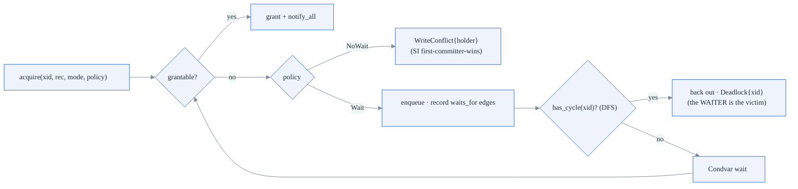
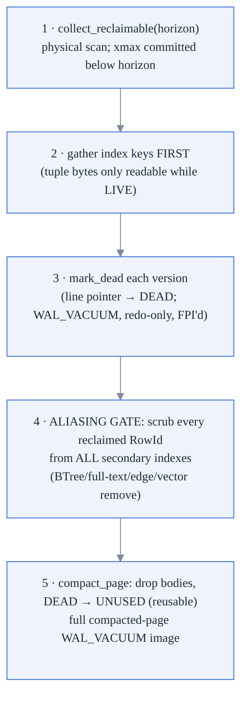

# 4. Transaction Engine — MVCC, Isolation, Locking, Vacuum

**Modules:** `txn.rs`, `mvcc.rs`, `lockmgr.rs`, `read_handle.rs`,
`autovacuum.rs`, `concurrency_hooks.rs`. **Locked decisions:** D4 (MVCC tuple
header), D10 (RC default, RR offered), D11 (`on_read`/`on_write` seam), D12
(SI abort path before RC re-evaluation).

> **Key shipped optimization (item 88):** bulk lock elision — xmax stamping *is*
> the row lock for batch DML; per-row lock-table entries are skipped when the
> caller batches many rows under the same xid. See §4.3.

---

## 4.1 Snapshots and visibility

```rust
Snapshot { xmin: Xid,            // smallest active xid at construction
           xmax: Xid,            // next_xid at construction ("future" fence)
           active_xids: HashSet } // frozen at construction — RR's stability
```

`is_visible(tuple, snapshot, self_xid)`:

```
inserter visible = tuple.xmin == self_xid  OR  committed-at-snapshot(xmin)
if not → invisible
if tuple.xmax == 0 → visible (live tip)
deleter visible  = tuple.xmax == self_xid  OR  committed-at-snapshot(xmax)
visible ⇔ deleter NOT visible
```

Properties worth internalizing:

- **Self-visibility**: a transaction always sees its own inserts and its own
  deletes hide rows from itself — regardless of commit state.
- **There is no "aborted" tuple state.** Aborts are *physically undone*
  (`abort` replays the undo log in reverse: self-stamp inserted rows invisible,
  revert xmax stamps to 0), so on-disk `xmin`/`xmax` never reference an aborted
  transaction. Visibility only ever distinguishes committed vs. still-active.
- **Reclaimability is visibility's inverse**: `is_reclaimable(xmax, horizon) =
  xmax != 0 && xmax < horizon` — sound precisely *because* a non-zero on-disk
  xmax always denotes a committed deleter. Boundary deliberate:
  `is_reclaimable(h, h) == false` (a snapshot at the horizon might be the
  deleter's own).

**Version chains are backward-only** (`prev_page`/`prev_slot` in the tuple
header). UPDATE = stamp old version's xmax + insert new version, both in one
mini-txn (doc 2 §4). `heap.get` never walks forward — the B-tree is the only
forward-resolution mechanism, which is why index maintenance may *coalesce* but
never *skip* entries (doc 6 §5).

## 4.2 Isolation levels

| Level | Snapshot lifetime | Write-write conflict | Notes |
|---|---|---|---|
| `ReadCommitted` (default) | fresh per statement | `WriteConflict` (no-wait) | a *committed* superseder is transparently re-read by the next statement's fresh snapshot; the conflict error only fires against a still-active writer. Blocking-then-re-evaluate (Postgres EvalPlanQual) is a documented gap pending `WaitPolicy::Wait` on the DML path |
| `RepeatableRead` (= SI) | fixed at BEGIN | `SerializationFailure` | first-committer-wins via NoWait row locks (D12) |
| `Serializable` (SSI) | fixed at BEGIN | `SerializationFailure` + pivot abort | Cahill-style, see below |

`snapshot_for_statement` implements the entire difference: RC recomputes, RR/SSI
clone the BEGIN-time snapshot. Same visibility code either way (D10).

### SSI (reduced Cahill)

`SsiState { reads, writes: HashSet<RowId>, in_conflict, out_conflict }` —
allocated **only** for Serializable transactions (zero overhead otherwise).
Executors call `ssi_note_reads` after scans and `ssi_note_write` on
supersession; these form rw-antidependency edges against both active and
recently-committed serializable transactions. At commit, a **pivot** (both
flags set) aborts with `SerializationFailure` — checked *before* the txn leaves
the active set; `Engine::commit` converts it into a real rollback.

Reduced form, documented: row granularity (no predicate locks → no phantom
protection); statement-granularity tracking at the executor; a write-skew pair
may occasionally both abort (sound, over-conservative). The `on_read`/`on_write`
heap seam (D11) remains the hook for finer-grained tracking later — the
retrofit trap this architecture explicitly avoided.

## 4.3 Lock manager (`lockmgr.rs`)



- Keyed by `RecordId::row((page_id << 16) | slot)` — globally unique across all
  tables because pages come from one shared pool (this is what gives graph
  edges per-edge locking for free).
- Modes S/X exist; MVCC readers take **no** locks; every current caller takes X
  via `try_acquire_write` (NoWait).
- The wait-for graph is acyclic before each check (every previous cycle-closer
  was aborted), so any new cycle must pass through the requester — one DFS from
  the requester suffices.
- Held in memory only, never WAL-logged: recovery implicitly aborts in-flight
  transactions.
- Row write locks are held for the whole transaction, so commit needs **no
  re-validation step** — conflicts were caught at write time.

### Bulk lock elision (item 88)

For batch DML (`delete_many`, `update_many`, `hot_update_many`), stamping
`xmax = xid` on a tuple is itself the ownership claim: any concurrent writer
attempting to stamp the same slot will observe `xmax != 0` and raise
`WriteConflict`. Recording a separate entry in the lock table would be redundant.

Bulk lock elision skips the per-row `lock_mgr.try_acquire_write` call for batch
operations. **Undo still runs per-row:** the undo log records each
`WAL_XMAX_BATCH` or `WAL_INSERT_BATCH` slot, and `abort(xid)` reverts them all
in reverse order. The elision reduces lock-table mutex acquisitions from O(rows)
to O(1) per batch — at 50k rows, this eliminates ~50,000 mutex round-trips.

The correctness gate: elision is only valid when the batch is under a single xid
and every slot check (`xmax == 0`) has already been done atomically under the
page latch before stamping. `hot_update_many` Phase A performs this check —
WriteConflict on any slot aborts the mini-txn before any stamps are committed.

## 4.4 Vacuum (M10) and the index-aliasing gate

The horizon is `min(snapshot.xmin)` over **all live writer transactions and all
registered concurrent readers** — `ReadHandle` reads allocate no xid, so they
register their snapshot's xmin under a `#[must_use]` RAII `ReadRegistration`
(deregistered on Drop). Replication slots hold the horizon back too.



**Why the gate is the single most important correctness step:** stale index
entries are harmless only while slots are never reused. The moment a slot is
reused, a stale `(page, slot)` entry can resolve to a *live, MVCC-visible,
semantically wrong* row. The hazard was reproduced deterministically (aborted
edge creation leaves a stale adjacency entry; slot reuse then surfaces a
wrong-but-visible edge) and the gate makes it impossible; `vacuum_inner(false)`
exists solely so the regression test can re-open the hazard.

`WAL_VACUUM` is redo-only and idempotent (mark-DEAD is a no-op on a non-live
slot; the compacted-image replay is page-LSN-gated), so a crash anywhere inside
vacuum recovers cleanly and a re-run reclaims nothing extra (P10, P26).

### Autovacuum

A `std::thread` worker (not tokio — the sync-core invariant) holding a
**`Weak<Engine>`** (a strong `Arc` would form a refcount cycle preventing
`Engine::Drop`). Policy is Postgres-shaped: run when
`dead > threshold + scale_factor · live`, with env knobs
(`UNIDB_AUTOVACUUM_{ENABLED,THRESHOLD,SCALE_FACTOR,NAPTIME_SECS}`, defaults
on/50/0.2/60 s). It only decides *when* — the pass is the same, already-safe
manual vacuum (same `write_serial` + latches), so crash-during-autovacuum
recovers identically. Dead/live estimates are global atomics counted at the
statement chokepoints (never inside `heap.rs` — recovery redo also drives that
code); a horizon-blocked remainder stays counted so the pass re-fires once the
horizon advances. Shutdown = handle Drop → bounded 5 s join, with a self-join
guard for the worker-holds-last-Arc race.

## 4.5 Border cases

| Case | Handling |
|---|---|
| Two txns update the same row | row lock (NoWait) → `WriteConflict`; loser aborts (SI) or is re-read (RC) |
| Holder already committed & released | old tuple's `xmax != 0` check catches it — the lock table can't see a departed holder |
| Deadlock (opposite-order updates) | wait-for-graph DFS; the waiter that would close the cycle backs out with `Deadlock` — no hang (tested end-to-end) |
| Write skew under RR | commits (SI allows it); under Serializable the pivot aborts |
| Long-lived RR txn / slow reader | pins the vacuum horizon (reported via `VacuumReport.horizon_blocked`); also delays auto-checkpoint (which fires only when quiescent, so truncation can't strand undo) |
| Reader vs. writer teardown race | `ReadRegistration` RAII keeps the horizon held for the whole read |
| Read-only transaction | writes no commit record, pays no fsync (`commit` → `None`) |
| Abort after partial statement | undo log replayed in reverse; mini-txn abort record; locks released |
| SSI pivot detected at commit | error surfaces *before* state cleanup; Engine converts to rollback |
| xid counter after checkpoint+reopen | persisted `next_xid` in control file (v3 fix) — no xid reuse |

## 4.6 Metrics

- `/stats`: `commits`, `aborts`, `active_transactions`,
  dead/live tuple estimates, `unidb_autovacuum_runs_total`,
  `unidb_autovacuum_last_run_epoch_secs` (Prometheus gauges).
- Bench anchors (doc 10): 8-writer group commit 3.55–3.82× scaling; autovacuum
  bounds churn bloat to 35 pages vs 82 un-vacuumed (2.3× fewer); point-read
  latency restored 35.4 → 5.85 µs by a vacuum pass after 30× churn.
