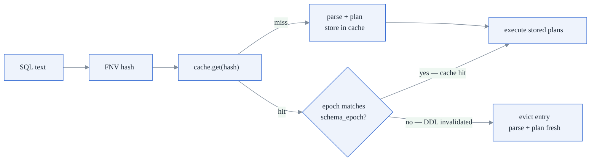
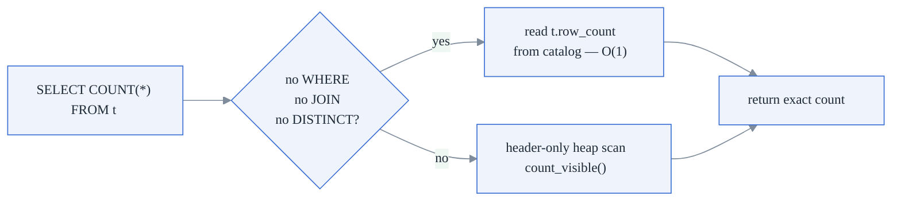

# 5. SQL Query Engine

**Modules:** `sql/{parser, logical, query, plan, optimizer, statistics,
query_exec, executor, join, aggregate, sort, explain, datetime}.rs`,
`catalog.rs`. ~10.5 k lines — the largest processing engine.

---

## 5.1 Pipeline

```mermaid
%%{init: {"theme":"base","themeVariables":{"primaryColor":"#eef3fc","primaryTextColor":"#1f2a37","primaryBorderColor":"#3b6fd4","lineColor":"#7f8c9b","secondaryColor":"#eef7f1","secondaryBorderColor":"#2f9e5f","tertiaryColor":"#fdf5e8","tertiaryBorderColor":"#d98b1f","fontFamily":"Segoe UI, Arial, sans-serif","fontSize":"14px","clusterBkg":"#f7fafc","clusterBorder":"#dce4ec"}}}%%
flowchart LR
    T["SQL text"] --> CACHE{"Plan cache\n(item 96)\nhit on hash+epoch?"}
    CACHE -->|hit| RUN
    CACHE -->|miss| P["sqlparser crate\n(GenericDialect)"]
    P --> TR["AST translation\n(parser.rs)"]
    TR -->|trivial single-table| S["LogicalPlan::Select\n(fast path)"]
    TR -->|join / agg / subq / CTE\nORDER·GROUP·DISTINCT·LIMIT| Q["LogicalPlan::Query(QuerySpec)"]
    S --> RLS["apply_rls"]
    Q --> RLS
    RLS --> BIND["bind $n params\n(before execution — injection-safe)"]
    BIND --> OPT["optimizer\n(cost-based when eligible)"]
    OPT --> PHYS["PlanNode tree"]
    PHYS --> STORE["store in plan cache"]
    STORE --> RUN["Runner (query_exec)"]
    S -.->|plain SELECT, no NEAR| RO["lock-free concurrent read path\nexec_select_readonly"]
```



Deliberate choice: the parser is the **`sqlparser` crate**, not hand-rolled —
the budget goes to the executor, not parser plumbing (the one hand-rolled parser
in the codebase is Cypher). Bind parameters are `$n` only, substituted as
`Literal`s *before* planning/execution — a bound value is always data, never
re-parsed as SQL.

**The two-route split is architectural**: a trivial single-table filter/project
stays `LogicalPlan::Select` and keeps the concurrent-read fast path (AND-only
WHERE on this route); `needs_query` routes anything with a join, aggregate,
GROUP BY/HAVING, DISTINCT, ORDER BY, LIMIT/OFFSET, CTE, or subquery to the
`QuerySpec` machinery (whose `QExpr` supports OR/NOT/IS NULL/subqueries).

### Supported surface (summary)

- **Types:** INT64, TEXT, BOOL, JSON, DECIMAL(p≤38,s), TIMESTAMP (UTC micros),
  FLOAT (f64), UUID, BYTEA, DATE, TIME, VECTOR(n); SERIAL/IDENTITY → Int64.
- **DDL:** CREATE TABLE (column + table constraints: NOT NULL, UNIQUE, PK,
  DEFAULT, CHECK, FK-existence, IDENTITY), CREATE INDEX … USING
  BTREE|HNSW|FULLTEXT (single column), ALTER TABLE ADD/DROP COLUMN, DROP TABLE
  [IF EXISTS], TRUNCATE, ANALYZE.
- **Queries:** INNER/LEFT/RIGHT/CROSS joins; COUNT/SUM/AVG/MIN/MAX (+DISTINCT);
  GROUP BY/HAVING; ORDER BY (output column/alias/position); DISTINCT;
  LIMIT/OFFSET; scalar/IN/EXISTS subqueries (correlated included); IN-lists;
  non-recursive CTEs; `->`/`->>` JSON extraction; `NEAR(col, [vec], k)`;
  EXPLAIN / EXPLAIN ANALYZE.
- **Rejected explicitly** (clear errors, not silent wrong answers): FULL/
  NATURAL/USING joins, WITH RECURSIVE, window functions, GROUP BY ALL,
  `?`/`:name` params.

## 5.2 Optimizer

Cost-based planning engages only when every base relation is a plain,
**ANALYZE'd** base table and the join tree is inner/cross-only; otherwise a
rule-based plan with a residual `Filter` is used (never a wrong plan, just a
less clever one).

- **Join ordering: Selinger left-deep dynamic programming** over subset
  bitmasks, minimizing summed intermediate cardinality; ≤10 relations use the
  DP, more fall back to greedy. Cartesian steps carry a 10¹² penalty so
  connected orders always win. Equi-edges become hash joins; the rest nested
  loops.
- **Statistics (durable):** ANALYZE computes per-table `row_count` and
  per-column `{distinct, null_count, min, max, 8-bucket equi-depth histogram}`,
  persisted in the catalog — never recomputed on open. Equality selectivity =
  `frac_non_null / distinct` (zero outside min/max); range selectivity from the
  histogram.
- **Index-vs-scan (SELECT access paths):** the most selective B-tree-indexed
  predicate becomes an `IndexScan` only when its estimated selectivity ≤ 0.1.
- **A second, separate gate on the write path** (UPDATE/DELETE row targeting):
  equality always uses the index; a **range** uses it only when stats say
  selectivity ≤ 0.3; **no stats → sequential scan**. Measured motivation:
  forcing the index on a 50 %-selective DELETE *regressed* it — random heap
  access loses to a sequential scan when matches aren't few.
- The single-table SELECT B-tree fast path (`try_exec_select_btree`) applies
  **no** selectivity gate — candidates are resolved (in parallel when large) and
  re-checked; wrong-guess cost is bounded.

## 5.3 Executors

Pipeline order for the Query route:
`FROM → WHERE → [Aggregate → HAVING] → Projection → DISTINCT → ORDER BY →
LIMIT/OFFSET`. Batches are materialized between operators; the spill paths bound
peak memory (peak RSS stayed ~18–35 MB across all benchmarks).

| Operator | Algorithm | Spill strategy |
|---|---|---|
| Hash join | build-side hash table; orientation chosen so unmatched outer rows come from the probe side | **Grace partitioning**: both sides hashed (FNV-1a) into `clamp(2·⌈rows/mem⌉, 4, 256)` temp partitions, joined pairwise; spill dir removed on drop |
| Sort-merge join | self-sorting merge; equal-key runs cross-multiplied; NULL keys never match | inherits external sort |
| Index nested-loop | probes the durable B-tree per outer row (`search_eq`); chosen when the inner side is a base scan with a B-tree on the join key (Inner/Left) | n/a |
| Block nested-loop | cross joins / non-equi predicates | n/a |
| ORDER BY | in-memory sort under `mem_rows`, else **external merge sort**: sorted runs on disk + k-way `BinaryHeap` merge with one resident row per run; NULL sorts smallest (SQLite parity) | runs on disk |
| Aggregates | hash aggregation; `COUNT(*)`-only aggregates over a scan short-circuit to header-only counting (§5.4) | — |

`work_mem` is enforced as **row counts**: per-query `query_limits::work_mem_rows`
first, then `UNIDB_HASH_JOIN_MEM_ROWS` (default 1 M) / `UNIDB_SORT_MEM_ROWS`.
Query timeouts and cancellation (P5.f) are thread-local `QueryLimits` checked
every 1,024 rows in scan loops (`QueryTimeout` / `QueryCancelled`).

Correctness for the whole Phase-4 surface was checked **differentially against
SQLite** (rusqlite dev-dependency) — same statements, same data, same results.

## 5.4 Read-path and write-path optimizations

### Plan cache (item 96)

Parsing and planning are the dominant cost for short-running queries on small
tables. The plan cache eliminates repeated work for the same SQL text:

```
struct PlanCacheEntry {
    epoch:  u64,          // schema_epoch when plans were parsed
    plans:  Vec<...>,     // one LogicalPlan per statement in the batch
}

PlanCache {
    entries: HashMap<u64, PlanCacheEntry>,  // keyed by FNV hash of SQL text
    capacity: usize,                         // 1,024 entries (PLAN_CACHE_CAPACITY)
}
```

Lookup flow:



`schema_epoch` is an `AtomicU64` bumped on every DDL statement. Any DDL makes
all existing cache entries stale, so they are lazily evicted on next access.
Capacity is 1,024 entries with LRU eviction on overflow. **Measured: 537–891×
speedup** on parse overhead for repeated queries.

### O(1) COUNT(*) (item 97)

`TableDef` gains a `row_count: i64` field in the catalog JSON. Every committed
INSERT/DELETE updates this field atomically at commit time via
`txn_mgr.take_row_count_deltas`. This enables a fast path for unfiltered
`COUNT(*)`:



`row_count = 0` is treated as stale (not a real zero — a fresh table starts at
0 but INSERT increments it on first commit). If the catalog write fails after
commit, `row_count` resets to 0 and the next COUNT falls back to the scan.
FORMAT_VERSION bumped to v11 to prevent old binaries from treating stale zero
as an exact result.

### Batch INSERT with InsertAccum (item 98)

A `VALUES (r1), (r2), ..., (rN)` statement streams rows through `InsertAccum`
(see doc 2 §2.4). From the SQL engine's perspective, this means the executor
calls `heap.insert_accumulating(row, &mut accum)` for each row, then
`heap.flush_insert_accum(&mut accum)` once at the end. UNIQUE enforcement runs
per-row before accumulation, so uniqueness is not deferred.

### GROUP BY decode pushdown (item 46)

The GROUP BY hash aggregation pushes the predicate + group-key decode into the
scan workers: each worker decodes only the needed columns and increments its
local partial aggregate. Workers merge their partial aggregates after the scan.
This keeps the full row body out of the aggregate phase entirely. Measured:
GROUP BY 0.23× → **1.44× vs Postgres** (unidb faster, items 46+56 together).

### Other read-path techniques

1. **Two-phase decode pushdown.** `deform_row(bytes, cols, upto, needed)`
   materializes only referenced columns, stopping after the last needed index.
   Predicate columns decoded first; projection columns decoded only on a match.
   Measured: filtered SELECT decodes/row 2.00 → 0.00, cols/row 8.00 → 5.00,
   +28 % absolute.
2. **Header-only scan for COUNT(*).** `Heap::count_visible` reads only the
   24-byte MVCC header per slot. Measured at 316 M rows/s vs Postgres 46 M
   (**6.80× faster**) in Docker bench (Table 3).
3. **Bitmap-style candidate ordering.** RowId candidate lists sorted by
   `(page, slot)` before heap resolution — sequential-ish access on fragmented
   tables.
4. **Arena allocator for filtered SELECT (item 54).** Filtered scan results
   allocated from a per-query arena instead of the global allocator. Measured:
   +24% filtered SELECT throughput, RSS −19 MiB.

`ROWS_DECODED` / `COLS_DECODED` atomic counters instrument the decode work per
query — the benches report dec/row and cols/row columns so each optimization's
effect is measured, not assumed.

## 5.5 Catalog (`catalog.rs`)

- The whole catalog (all `TableDef`s + statistics) is one serde_json blob
  written to a fresh page on every change; `control.catalog_root` points at the
  latest. This is control-plane metadata — the "no serde on the hot path" rule
  applies to per-row page/WAL codecs, not here.
- `TableDef`: columns (with `index: Option<IndexKind>`,
  `index_root: Option<PageId>` — the durable B-tree meta page), `fsm_meta`
  (durable FSM tree; `None` = legacy fallback), `rls_policy`, `events_enabled`,
  constraints, `serial_next` counters, and **`generation: u64`** — a schema-shape
  tripwire bumped by every shape-changing DDL; DML captures it at plan time and
  `debug_assert!`s it unchanged at write time, turning any future
  lock-discipline regression into a loud test failure instead of silent
  corruption.
- **Catalog is not MVCC-versioned** — DDL is immediate and global. Multi-
  statement requests snapshot `catalog_root` first and restore it on failure
  (request-level DDL rollback).
- SERIAL allocation persists the catalog per value — crash-safe monotonic
  sequence (batching is a filed follow-up; INSERTs into SERIAL tables therefore
  escalate to the exclusive catalog path, doc 10 §3).

## 5.6 Border cases

| Case | Handling |
|---|---|
| SQL injection via string concat | `$n` binds substitute literals pre-execution; bound values never re-parsed |
| NULL semantics | three-valued IN/NOT-IN; NULL join keys never equi-match; NULL sorts smallest; `literal_ord` refuses NULL comparisons |
| Rows written before ADD COLUMN | missing tail columns decode to the coerced DEFAULT or NULL |
| Duplicate within one multi-row INSERT | uniqueness checked under a fresh per-row snapshot (own writes visible) |
| UNIQUE with NULL components | that unique set is inactive for the row (SQL standard behavior) |
| UPDATE self-conflict on unique check | current version excluded via `exclude: row_id` |
| Table with no UNIQUE constraints | `has_unique` skip: no per-row snapshot, no O(N) scan per row (the A4 fix) |
| Sub-query inside a parallelizable predicate | falls back to serial (needs Runner storage access) |
| Un-analyzable/no-stats range DML | prefers sequential scan (never a blind index bet) |
| CTE / outer join in cost-based path | optimizer disengages to rule-based planning |
| DDL failure mid-request | catalog root restored — schema untouched |
| Legacy (pre-FSM) table DML | escalates to the exclusive catalog path |

## 5.7 EXPLAIN

`EXPLAIN` renders the physical `PlanNode` tree (access paths, join order,
operators); `EXPLAIN ANALYZE` executes and annotates with actual row counts —
the tool used to verify the optimizer's index/join choices in Phase 4's
differential tests.
