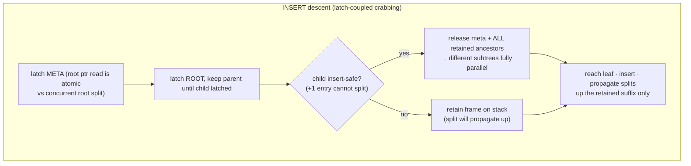

# 6. Indexing Engines — DiskBTree & Full-Text

**Modules:** `btree_index.rs` (1.8 k lines), `fulltext.rs`.
The `DiskBTree` is the most-reused structure in the system: SQL secondary
indexes, the heap's free-space map, full-text postings, graph adjacency, vector
postings, and the LOB directory are all instances of it.

---

## 6.1 Node format

Every node is a **standard page** (28-byte header, CRC, LSN), so buffer-pool
checksumming and the D5 WAL-before-page invariant apply unchanged.

```
META page  : NODE_META(0)     | root_page_id u32          ← stable id; root splits
                                                             repoint the CONTENT, id never moves
INTERNAL   : NODE_INTERNAL(2) | key_count u16 | child[0] u32 | key_count × (key ‖ child u32)
LEAF       : NODE_LEAF(1)     | entry_count u16 | next_leaf u32 (right link) | entries (key ‖ RowId[6B])
```

- Keys are `OrderedValue::{Int, Text, Bool}` — the `Ord` projection of a SQL
  `Literal` (Vector/Json/NULL are rejected as keys). Comparison happens
  in-memory after decode, so the byte encoding **need not be order-preserving**.
- The **stable meta page id** (stored in `ColumnDef.index_root` /
  `TableDef.fsm_meta` / engine meta fields) is the O(1)-open moat: `Engine::open`
  reconstructs any tree from its meta id with **zero rebuilding** — for every
  index type in the system.

## 6.2 Durability model — redo-only full-page images

Every structural write logs the **entire dirtied node page** as `WAL_INDEX`
(redo-only, no undo). Rationale:

- An index entry is a **hint**, re-validated against MVCC downstream — a stale
  or extra entry from an aborted transaction is harmless, so undo is
  unnecessary.
- The dangerous direction — a *visible row with no entry* — is prevented by
  ordering: the index mini-txn is durable during statement execution, before the
  user transaction's `WAL_TXN_COMMIT` can exist.
- Recovery replays node images in LSN order (last writer wins), which is what
  lets crash point P13 rebuild a whole tree from WAL alone after `data.db` is
  deleted outright.

`insert_in_txn` brackets *all* pages touched by one insert (leaf, split chain,
ancestors, meta on a root split) in **one mini-txn** — a split is atomic.
The `_in_txn` form also lets callers fold tree writes into a larger atomic unit
(the heap's atomic grow = page init + FSM entry in one mini-txn, P28).

## 6.3 Concurrency — crabbing writes, latch-free reads



- **Deadlock-free by construction**: latches are acquired strictly top-down
  (meta → root → leaf) — a single global order. A `loom` model (isolated
  `loom-crabbing` crate, so `--cfg loom` never contaminates real deps)
  exhaustively enumerates interleavings proving deadlock-freedom, mutual
  exclusion, and no lost updates across same-leaf contention and splits.
- The safe-node predicate is **exact for fixed-size keys** (Int/Bool) and
  **conservative for Text** (internal nodes never deemed safe) — correctness
  over parallelism when key size is variable.
- `set_value` / `remove` locate the leaf unlatched, then **re-read it under the
  exclusive latch** and recompute — never writing pre-latch bytes over a
  concurrent split.
- **Reads take no latches at all.** Safety rests on three properties: the pool
  returns owned per-page copies (no torn node read), right-linked leaves let a
  scan that lands on a just-split leaf walk to migrated keys, and every returned
  RowId is re-validated by MVCC — a transiently stale read is corrected, never
  wrong.

Measured: indexed 8-writer SQL throughput 768 → 1,058 commits/s (+38 %) with
crabbing enabled, approaching the ~1,260 unindexed fsync floor; the residual gap
is `WAL_INDEX` full-page-image append contention (format-inherent), not tree
latching. The toggle (`UNIDB_CONCURRENT_SQL_WRITES`) is default-off with a
runtime revert switch — the field-safety net.

## 6.4 Write amplification — per-leaf WAL coalescing (A1)

`insert_many` sorts a statement's entries so same-leaf keys are contiguous,
absorbs into each leaf every key inside its `[min, max]` span that fits without
splitting, and emits **one `WAL_INDEX` image per dirtied leaf** instead of one
per entry. A bulk UPDATE re-inserting thousands of unchanged keys lands in a few
dozen leaves: index WAL fell **8,868 → 619 bytes/row (14×)**, driving the bulk
UPDATE benchmark 0.11× → 0.34× vs Postgres (3.3×). Boundary/overflow keys fall
back to the proven per-entry path. Crash point P29 covers all three recovery
shapes (bulk non-key update, key change, incomplete statement).

**A correctness lesson is recorded here deliberately:** the original plan —
"skip index maintenance for unchanged columns" — is *provably wrong in this
engine*. Updates are insert-new-version and `heap.get` never walks forward, so
the B-tree is the **only** mechanism that can find a row's newest version; a
skipped entry makes the live row unfindable by any index scan (verified: a point
SELECT returned `[]` after a non-key UPDATE with the write skipped). What
shipped is coalescing — same WAL win, no lost rows.

## 6.5 The duplicate-key-spanning-leaves bug (found by the vector spike)

A duplicate run straddling a leaf boundary was under-returned: `find_leaf`
routed right on equality, landing past earlier duplicates. Fix: **search routes
left on `key ≤ separator`** (reaching the *leftmost* possible leaf) and
`search_eq` walks rightward via the leaf links until a strictly greater key —
robust to a run spanning any number of leaves. The insert path keeps `<` routing
so new duplicates append after existing ones. Impact radius before the fix:
vector recall capped at 0.912, full-text tokens in many documents, graph hub
nodes — any hot key. Regression test: a 3,000-duplicate key spanning ~7 leaves.

## 6.6 Special deployments of the same tree

| Deployment | Key → Value | Notes |
|---|---|---|
| SQL secondary index | column value → RowId | `CREATE INDEX … USING BTREE` |
| Heap FSM | `page_id` → free bytes (in the RowId.slot field) | `max_entry` (one O(log n) rightmost descent) = durable append tail; `page_directory` leaf-walk = full directory for scans/vacuum |
| Full-text postings | token → RowId (one entry per token per row) | §6.7 |
| Graph adjacency | `from_id` → edge RowId | doc 8 |
| Vector postings | IVF `cell_id` → RowId | doc 7 |
| LOB directory | `lob_id` → chunk RowId | doc 2 §6 |

## 6.7 Full-text engine

- **Build:** `CREATE INDEX … USING FULLTEXT` tokenizes each row (whitespace
  split → strip non-alphanumeric edges → lowercase) and inserts
  `(token, row_id)` per token into a DiskBTree. Same tokenizer at query time, so
  the token sets always agree.
- **Query:** `Engine::search_fulltext` (Rust API; no SQL `MATCH` surface yet)
  tokenizes the query, runs one `search_eq` per token, **intersects starting
  from the shortest posting list**, then re-validates every candidate against
  the caller's MVCC snapshot via the heap.
- Deliberately minimal: AND-only semantics, no stemming/stopwords/BM25 ranking
  (roadmap, doc 12). Durable and crash-recovered like every other tree (P14),
  never rebuilt on open.

## 6.8 Border cases

| Case | Handling |
|---|---|
| Root split vs concurrent readers | meta content repointed under the still-held meta latch; readers re-descend from an owned copy |
| Scan lands on just-split leaf | right-link walk finds migrated keys |
| Aborted txn's index entry | harmless hint — filtered by MVCC re-validation |
| Crash between index write and user commit | redo-only images replay; entries for undone rows are stale hints, filtered |
| Duplicate run across leaves | leftmost-descent + right-walk (§6.5) |
| Vacuumed/reused slot behind an entry | vacuum scrubs indexes before slot reuse (doc 4 §4.4) |
| Text keys during crabbing | conservative safe-node predicate — never under-latch |
| Empty query (full-text) | matches nothing (documented) |
