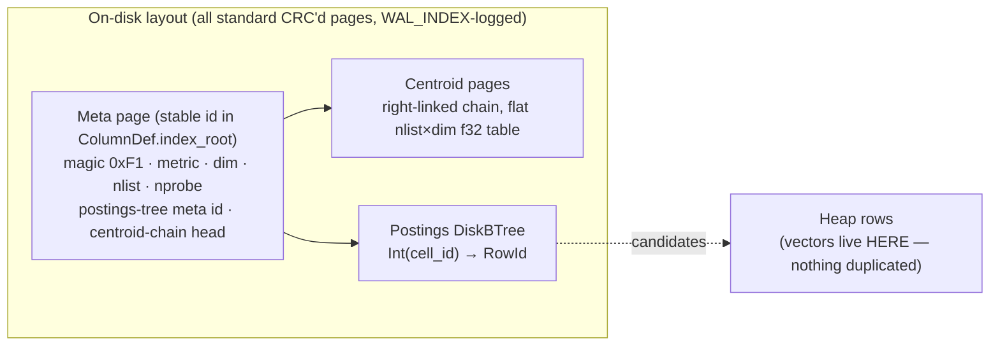
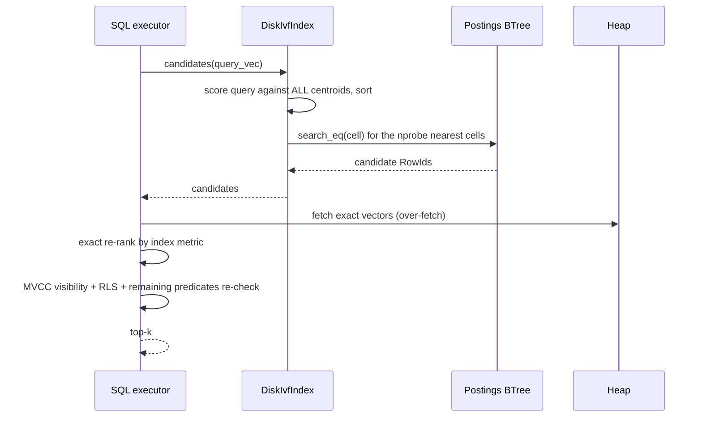

# 7. Vector Engine — from HNSW to Durable IVF-Flat

**Modules:** `disk_vector.rs` (production), `vector.rs` (retired baseline).
**Surface:** `VECTOR(n)` column type, `CREATE INDEX … USING HNSW` (name kept for
compatibility — the implementation is IVF-Flat), `NEAR(col, [v…], k)`.

---

## 7.1 History: why HNSW was retired

The M2 vector index wrapped the `instant-distance` HNSW crate. Two structural
problems:

1. **No incremental insert.** The crate only builds from a full point set, so
   every `upsert`/`remove` buffered all live points and **rebuilt the entire
   graph** — the "rebuild-per-upsert pathology." Building 1,200×32-d vectors
   took **30.2 seconds**; RAM was O(corpus).
2. **An HNSW graph does not page cleanly.** Its edges are random-access pointers
   across the whole graph — hostile to an 8 KiB-page store, and making it
   durable would have required new storage machinery.

An async background worker amortized rebuilds for a while (write returns
immediately; index catches up), but P3.c replaced the whole approach and retired
the worker. `vector.rs` survives only as the bench baseline and the home of the
`Metric` enum (Euclidean = pgvector `<->`, default; Cosine = `1 − cos`,
`<=>`; zero-length vectors are defined maximally distant under cosine).

## 7.2 Production design: DiskIvfIndex (IVF-Flat)

The insight: an IVF cell's posting list is `cell_id → [RowId]` — **exactly a
`DiskBTree`**, which is already durable, WAL-logged, crash-recovered,
buffer-pool-managed, and vacuum-scrubbable. IVF-Flat therefore needed **zero new
storage machinery** — no new WAL record kind, page type, or format bump.
(DiskANN/Vamana was evaluated and deferred: research-grade construction, hard
updates — behind the same interface if ever needed.)

- **Stateless handle.** The struct is (meta page id, page size); every operation
  reloads the bounded O(nlist·dim) centroid table. `open()` is O(1) and the
  index is **never rebuilt on open** — completing the O(1)-open moat across all
  index types.
- **Training:** a few Lloyd's k-means iterations over a sample of committed
  rows, **once at CREATE INDEX, then fixed**. Deterministic evenly-spaced
  init. Production wiring picks `nlist ≈ √rows` (cap 256) and a recall-favoring
  `nprobe`, both stored in the meta page. Creating on an empty table yields a
  single origin cell — correct but flat; re-training as a maintenance operation
  (vacuum-like) is the filed follow-up.
- **Insert:** load centroids → assign to nearest → one posting-tree insert — one
  WAL mini-txn. **Remove** exists for vacuum's aliasing gate.
- **RAM:** `nlist × dim × 4` bytes, corpus-independent (4,096 B in the spike
  config).

## 7.3 Query path (NEAR)

Over-fetch-then-filter is the same contract every secondary index in the system
obeys: the index proposes, MVCC disposes. Exact re-ranking against heap vectors
means IVF's approximation only affects *which cells are probed*, never the
correctness of distances.

## 7.4 Results

Spike corpus 1,200×32-d, 30 clusters, 100 queries, k=10, nlist=32, brute-force
ground truth:

| Index | recall@10 | query | build | RAM |
|---|---|---|---|---|
| HNSW (in-RAM, rebuild-on-open) | 1.000 | ~26 µs | **30,223 ms** | O(corpus) |
| IVF-Flat nprobe=1 | 0.957 | 8 µs | 24 ms | 4,096 B |
| **IVF-Flat nprobe=4** | **1.000** | 31 µs | **24 ms** | **4,096 B** |
| IVF-Flat nprobe=8/16/32 | 1.000 | 59/113/216 µs | 24 ms | 4,096 B |

Production sweep: 20,000×64-d at nprobe=16 → recall **1.000** (~400 µs query,
983 ms build, 36 KB RAM); a fresh handle over the same meta page answers
identically (no-rebuild proof). Crash point **P17**: after a crash with no
checkpoint, the recovered index serves NEAR with recall@1 = 1.0 and exact top-5.

**Bonus find:** an early spike run capped IVF recall at 0.912 even at
nprobe=32 — root cause was the DiskBTree duplicate-key-spanning-leaves bug
(doc 6 §5), which also affected full-text and graph hubs. The spike's recall
harness is what surfaced it.

## 7.5 Border cases

| Case | Handling |
|---|---|
| Vector dimension mismatch | rejected at insert/query (dim in meta page) |
| Empty table at CREATE INDEX | single origin cell — functional, flat; re-train follow-up |
| Aborted insert's posting | stale hint, filtered by MVCC re-check |
| Vacuumed slot behind a posting | vacuum scrubs vector postings before slot reuse |
| Zero-length vector under cosine | defined maximally distant |
| Crash mid index write | `WAL_INDEX` full-page redo; P17 green |
| Drifting data distribution | centroids fixed post-training — documented limitation; re-train filed (doc 12) |

## 7.6 Future work pointers

Re-training as maintenance; SQL surface for metric/nprobe tuning; possible
DiskANN behind the same interface; filtered-NEAR pushdown. See doc 12.
