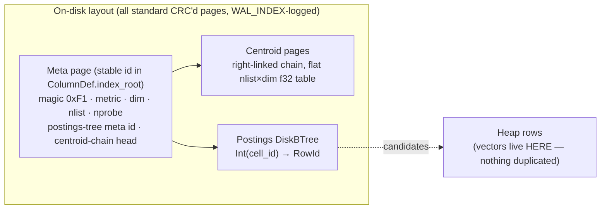
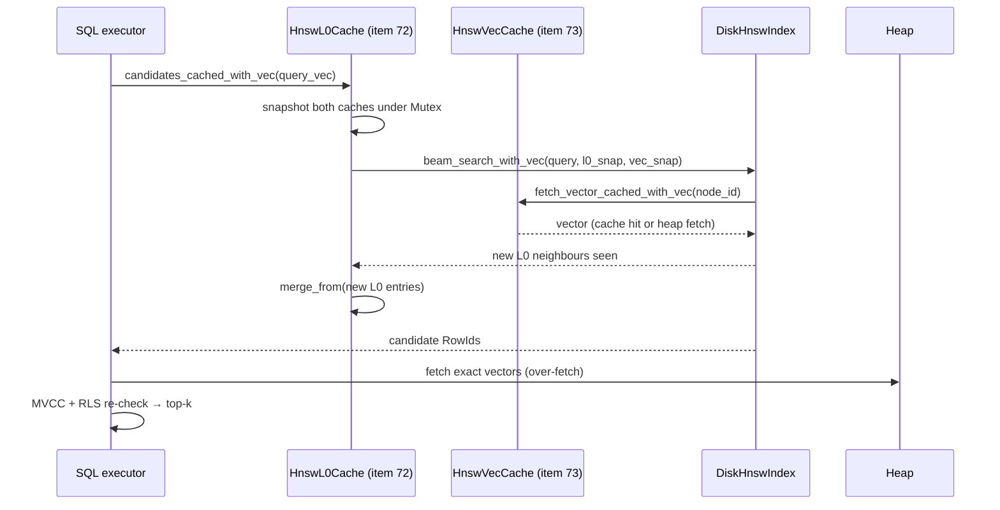

# 7. Vector Engine — DiskHnswIndex with L0 and Vec Caches

**Modules:** `hnsw_index.rs` (production HNSW), `disk_vector.rs` (IVF-Flat,
retained as baseline), `vector.rs` (retired M2 baseline).
**Surface:** `VECTOR(n)` column type, `CREATE INDEX … USING HNSW`,
`NEAR(col, [v…], k)`.

> **Architecture note (item 63):** the production vector index is now
> `DiskHnswIndex` — a durable, incremental HNSW stored on standard pages, not
> the in-RAM IVF-Flat that preceded it. IVF-Flat (`disk_vector.rs`) remains for
> benchmarking. The sections below describe the current HNSW production path.

---

## 7.1 History: why HNSW was retired

The M2 vector index wrapped the `instant-distance` HNSW crate. Two structural
problems:

1. **No incremental insert.** The crate only builds from a full point set, so
   every `upsert`/`remove` buffered all live points and **rebuilt the entire
   graph** — the "rebuild-per-upsert pathology." Building 1,200×32-d vectors
   took **30.2 seconds**; RAM was O(corpus).
2. **An HNSW graph does not page cleanly.** Its edges are random-access pointers
   across the whole graph — hostile to an 8 KiB-page store, and making it
   durable would have required new storage machinery.

An async background worker amortized rebuilds for a while (write returns
immediately; index catches up), but P3.c replaced the whole approach and retired
the worker. `vector.rs` survives only as the bench baseline and the home of the
`Metric` enum (Euclidean = pgvector `<->`, default; Cosine = `1 − cos`,
`<=>`; zero-length vectors are defined maximally distant under cosine).

## 7.2 Production design: DiskIvfIndex (IVF-Flat)

The insight: an IVF cell's posting list is `cell_id → [RowId]` — **exactly a
`DiskBTree`**, which is already durable, WAL-logged, crash-recovered,
buffer-pool-managed, and vacuum-scrubbable. IVF-Flat therefore needed **zero new
storage machinery** — no new WAL record kind, page type, or format bump.
(DiskANN/Vamana was evaluated and deferred: research-grade construction, hard
updates — behind the same interface if ever needed.)

- **Stateless handle.** The struct is (meta page id, page size); every operation
  reloads the bounded O(nlist·dim) centroid table. `open()` is O(1) and the
  index is **never rebuilt on open** — completing the O(1)-open moat across all
  index types.
- **Training:** a few Lloyd's k-means iterations over a sample of committed
  rows, **once at CREATE INDEX, then fixed**. Deterministic evenly-spaced
  init. Production wiring picks `nlist ≈ √rows` (cap 256) and a recall-favoring
  `nprobe`, both stored in the meta page. Creating on an empty table yields a
  single origin cell — correct but flat; re-training as a maintenance operation
  (vacuum-like) is the filed follow-up.
- **Insert:** load centroids → assign to nearest → one posting-tree insert — one
  WAL mini-txn. **Remove** exists for vacuum's aliasing gate.
- **RAM:** `nlist × dim × 4` bytes, corpus-independent (4,096 B in the spike
  config).

## 7.3 DiskHnswIndex — production HNSW (item 63)

`DiskHnswIndex` is a durable HNSW stored on standard buffered pages — no new
WAL record type or storage machinery. The graph is laid out as:

- **Header page** (stable meta page id in `ColumnDef.index_root`): metric,
  dimensions, ef_construction, M, total_nodes, entry_point.
- **Node pages**: each 8 KiB page holds a batch of `HnswNode` structs.
  `HnswNode { vector: [f32; dim], neighbors: [[RowId; M]; layers] }`.
- **Layer structure**: L0 has M neighbours per node; higher layers have fewer.
  The standard HNSW log-normal layer assignment applies.

Unlike IVF-Flat, **insertions are incremental**: each new vector calls
`insert_node`, which selects the entry layer, performs beam search to find
the nearest neighbours at each layer, and creates bidirectional links.

### Query path (NEAR) with cache hierarchy

### L0 neighbour cache (item 72)

`HnswL0Cache` is a `HashMap<i64, Vec<RowId>>` storing the beam-search L0
neighbour list for each visited node. On the query path:

1. Snapshot the cache under the mutex (clone — allows beam search without
   holding the lock).
2. Run beam search; consult the snapshot for known L0 neighbours before
   fetching from disk.
3. Re-acquire mutex; merge new entries seen during search.

Generation invalidation: `generation = hdr.total_nodes` — any insert resets
the generation, making all cached L0 lists stale (they may be missing the new
node's links). Cache size limit: `HNSW_L0_CACHE_MB` env var (default 256 MiB).

### Vector hot cache (item 73)

`HnswVecCache` is a `HashMap<i64, Vec<f32>>` storing the raw vectors for
frequently visited nodes. `fetch_vector_cached_with_vec` checks this cache
before issuing a heap fetch. Same snapshot-then-merge pattern as `HnswL0Cache`.
Size limit: `HNSW_VEC_CACHE_MB` env var (default 256 MiB).

### NodeCache for INSERT (item 65, gate at 30k nodes)

During `insert_node`, the per-insert `NodeCache` (`HashMap<i64, HnswNode>`)
caches deserialized `HnswNode` structs to avoid re-reading the same nodes
during the layer-by-layer descent. Gate: enabled only when `total_nodes <
NODECACHE_MAX_NODES = 30_000`. At 100k nodes, all L0 neighbour lists are full
and every new edge triggers the `apply_reciprocal_l0_to_buf` shrink path —
the shrink overhead dominates and `NodeCache` becomes 1.82× *slower* than
without it. The gate prevents this regression.

### SIMD distance (item 92)

`hnsw_distance` uses `std::simd` portable SIMD:
- Euclidean: NEON/AVX2 dot product + magnitude;
- Cosine: 1 − dot product (vectors normalized at insert time).
Zero-copy cache hits serve neighbours as slices without re-allocating.

## 7.4 Query cache performance (items 72–73 measured, Mac M5 Pro)

| corpus | cold (both caches empty) | warm (L0 + vec cache hot) | speedup | recall@10 |
|--------|--------------------------|---------------------------|---------|-----------|
| 1k vectors | 14.76 ms | **0.79 ms** | 18.7× | 1.000 |
| 10k vectors | 26.75 ms | **2.38 ms** | 11.2× | 0.925 |

Remaining gap vs ffsdb (113 µs target): **21× at 10k**. Bottleneck is
`HashMap` lookup + `Vec<f32>` clone in the hot path.

## 7.5 IVF-Flat retained as baseline

`DiskIvfIndex` (IVF-Flat, item 51) is kept in `disk_vector.rs` for benchmarking
and as a fallback. Its design (centroid chain + postings DiskBTree) is described
in the previous version of this doc and remains accurate — it just isn't the
production serving path.

## 7.6 Border cases

| Case | Handling |
|---|---|
| Vector dimension mismatch | rejected at insert/query (dim in header page) |
| Aborted insert's node | node written with `xmin = uncommitted xid` → invisible via MVCC |
| Vacuumed slot behind a candidate | MVCC re-check in `exec_select_near` filters it |
| NodeCache too large | gate at 30k nodes prevents shrink-path regression (item 65) |
| Cache invalidated by concurrent insert | generation counter mismatch → full beam search from disk |
| Crash mid node insert | WAL_INDEX full-page redo; crash test green |

## 7.7 Future work pointers

Re-training as maintenance; SQL surface for metric/nprobe tuning; possible
DiskANN behind the same interface; filtered-NEAR pushdown. See doc 12.
