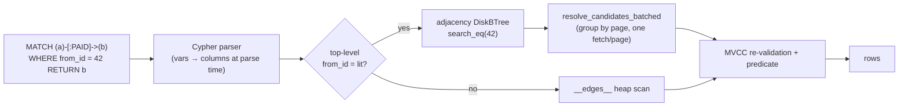

# 8. Graph Engine — Edges, Adjacency, Cypher

**Modules:** `graph/{edges, index, parser, logical, executor}.rs`,
`csr_index.rs` (bench-only).

---

## 8.1 Storage: edges are rows

Edges live in one synthetic system table:

```sql
__edges__(from_id INT64, to_id INT64, edge_type TEXT, props JSON)
```

This is deliberate reuse, not a shortcut: because an edge is an ordinary heap
row, it gets **full MVCC versioning, WAL durability, crash recovery, vacuum, and
plain SQL queryability** (`SELECT * FROM __edges__ WHERE …`) with zero new
storage-layer code. Row encoding reuses the SQL codec verbatim.
`ensure_edges_table` creates it idempotently at open.

**Per-edge locking costs nothing extra**: the lock key
`RecordId::row(page_id, slot)` is globally unique across all tables because
pages come from one shared buffer pool — so the existing row lock manager *is*
the per-edge lock manager.

## 8.2 Adjacency index

`from_id → [edge RowId]` is a **durable `DiskBTree`** over `__edges__.from_id`
(P3.b) — crash-recovered (crash point P15), never rebuilt on open, maintained
inline by `create_edge`/`delete_edge`.

It is a **candidate fetcher, not a source of truth**: every traversal
re-resolves candidates through the caller's MVCC snapshot, so an aborted edge
creation can never surface (this exact hazard is the deterministic regression
test for vacuum's aliasing gate, doc 4 §4.4).

**Batch-latch resolution** (`resolve_candidates_batched`, the hot-hub
optimization): candidates are grouped **by page**, so each distinct page is
fetched, decoded, and unpinned once instead of once per candidate; vacuum-
reclaimed line pointers are skipped via the slot-state gate; `is_visible` is
applied per tuple. This is the measured win on hub-heavy adjacency scans.

## 8.3 Cypher subset

A hand-rolled recursive-descent parser (surveyed crates were abandoned or the
wrong execution model). Locked v1 grammar:

```
MATCH (a)-[:TYPE]->(b) WHERE <AND-only comparisons> RETURN <bare identifiers>
```

- Single fixed-length **directed** hop; `-[]->` matches any type.
- Node variables are **opaque i64 ids** — `a.prop` access is rejected with a
  clear error (there is no nodes table to join yet).
- The variable→column mapping (`a`→`from_id`, `b`→`to_id`, `type`→`edge_type`)
  happens **at parse time**, so the executor reuses the SQL engine's
  `predicate_matches`/`eval_expr` **verbatim** — zero new expression-evaluation
  logic to maintain.
- Routing: a top-level `from_id = <literal>` predicate goes through the
  adjacency B-tree; anything else is an `__edges__` heap scan with the `:TYPE`
  filter AND-ed into the predicate.



## 8.4 The CSR story — a correctness post-mortem worth keeping

M7 added `CsrIndex` (classic Compressed Sparse Row: sorted `from_ids`,
`row_ptr`, `col_ind`), built asynchronously with **debounced** rebuilds (a burst
of edge writes coalesces into one rebuild). The original ship wired traversal to
"prefer CSR once `Ready`" — **a real bug found during M8's independent merge
verification**:

- `Ready` means *initial backfill done*, **not** *every write since is
  reflected*. A transaction could create an edge and immediately fail to see it
  in its own traversal — violating **self-visibility**, a stronger guarantee
  than the "may return fewer while Building" contract NEAR/full-text live under.
- The original review correctly ruled out *phantom* edges (MVCC re-validation
  catches those) but missed the *false negative* for the writer's own edge.
- The bug was invisible under `cargo test --workspace` but deterministic when
  the test binary ran in isolation — a lesson that workspace-level feature
  unification can mask a reproducible race.

**Fix:** traversal reverted to consulting the adjacency index unconditionally.
`CsrIndex` itself (construction, debounced rebuild) remains correct and is kept
**bench-only**. The benchmark then showed CSR at **parity** with the
batched-EdgeIndex path anyway (97.4 vs 97.7 µs @ 1 k edges; 998 vs 972 µs @
10 k) — contiguous adjacency only pays off in multi-hop traversal, which the v1
Cypher subset doesn't perform. Net: the revert cost nothing measurable today; if
CSR ever returns to the read path it needs a staleness/generation marker
(tracked as tech debt).

## 8.5 Border cases

| Case | Handling |
|---|---|
| Aborted `create_edge` | index entry is a stale hint; MVCC re-validation filters it |
| Stale hint + reused slot | impossible after vacuum's index scrub (the reproduced-then-fixed aliasing hazard) |
| Hot hub (huge adjacency list) | batch-latch by page; duplicate-key-spanning-leaves fix guarantees the full posting run is returned |
| Self-visibility of a just-created edge | guaranteed — adjacency index maintained inline, synchronously |
| `a.prop` in Cypher | explicit `SqlUnsupported` error, not silent NULL |
| Concurrent edge writes | ordinary row locks + page latches; `write_serial` covers the structural edge paths |

## 8.6 Future work pointers

Multi-hop/variable-length traversal (where CSR becomes valuable, gated on a
generation-marker design), a nodes table with properties, OPTIONAL MATCH and
aggregation in Cypher. See doc 12.
