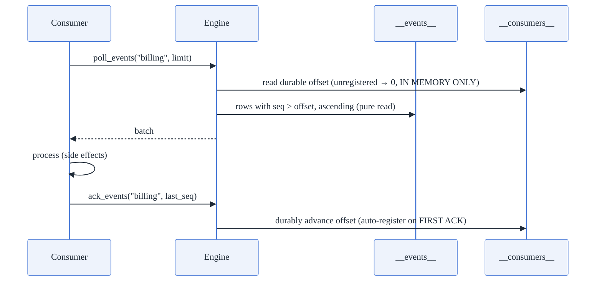

# 9. Event Queue Engine

**Modules:** `queue/{mod, payload}.rs`, `server/sse.rs`, engine methods
`enable_events` / `poll_events` / `ack_events` / `vacuum_events`.

---

## 9.1 Design decision: not WAL-derived

The obvious design — derive the event stream from the WAL — was **rejected** for
two concrete reasons: WAL records carry no table identifier, and checkpoint
truncation deletes segments with zero reader-awareness (a slow consumer would
either lose events or block truncation).

Instead, events are **copied synchronously into an ordinary durable heap table
at write time, under the writing transaction's own xid**:

```sql
__events__(seq INT64, xid INT64, table_name TEXT, op TEXT, payload JSON)
__consumers__(consumer_name TEXT, offset INT64)
```

Because the event row is written with the same two-line shape as every other
write (heap insert + undo record), its fate is tied to the surrounding
transaction by the **identical MVCC/abort machinery — zero new abort-path
code**. A rolled-back transaction's events vanish with it; a committed
transaction's events are exactly as durable as its rows. Zero cost when a table
hasn't opted in.

## 9.2 Producing events

- `Engine::enable_events(table)` flips a catalog flag (system tables rejected;
  self-syncs the WAL as a standalone catalog mutation).
- Per statement row, `send_event_capture`: row → JSON (`row_to_json` embeds JSON
  columns as nested values — not double-encoded strings — and renders
  Decimal/Timestamp/Uuid/Bytea as canonical strings so nothing is lost to f64),
  takes a monotonic `seq` from an atomic, inserts into `__events__`.

## 9.3 Consuming: Kafka-style manual commit



- **`poll_events` is a pure read** — it never writes `__consumers__`. If offsets
  advanced on fetch, a crash between fetch and processing would silently skip
  events; this is the Kafka manual-commit model, chosen explicitly.
- **`ack_events` is the only writer** of `__consumers__` (auto-registering the
  consumer on first ack, not first poll).
- **Replay** = re-poll from a lower offset; nothing physically deletes acked
  events until `vacuum_events`.

## 9.4 Subscribe API (SSE)

`GET /events/subscribe` is a **server-side poll loop, not WAL push** —
`poll_events` has no wake primitive. Default 500 ms interval, limit 100 per
poll, each poll its own short-lived read transaction; frames are
`id: seq / event: op / data: json`. Acks go over `POST /events/ack`, never over
the SSE connection (locked M5 decision). The multiplicative cost — N subscribers
× interval × poll cost — is documented plainly rather than hidden.

## 9.5 The slow-consumer-vs-vacuum contract

Resolved by making retention **explicit and never automatic**:

- A slow consumer's unacked events *accumulate* in `__events__`; they never
  block WAL truncation (events are rows, not WAL segments).
- `vacuum_events` computes the **minimum offset across all registered
  consumers** and MVCC-deletes rows with `seq ≤ min`. With **zero registered
  consumers it is a no-op** — a not-yet-registered consumer might legitimately
  need full history.
- It is deliberately not called from `checkpoint()` or any automatic path;
  the heap vacuum (M10) later reclaims the dead rows physically.

Trade-off stated honestly: `poll_events` has no predicate pushdown, so its cost
scales with `__events__`'s total row count, not with lag or limit — the operator
lever is running `vacuum_events` (doc 12 tracks predicate pushdown + automatic
retention policy).

## 9.6 Border cases

| Case | Handling |
|---|---|
| Producer txn rolls back | event rows physically undone with it (same undo log) |
| Crash between poll and ack | events re-delivered (at-least-once; offsets only move on ack) |
| Consumer crashes before first ack | never registered → its history is protected from `vacuum_events` by the no-op rule… |
| …but also: unregistered consumers don't hold retention | acked consumers' min drives deletion; registration is the retention contract |
| Duplicate ack / stale ack | offset advance is by value; a lower ack doesn't rewind |
| Multi-table txn with events on two tables | user-txn undo walks the whole undo log across `__events__` + data tables (tested crash case) |
| RLS | `poll/ack/vacuum_events` bypass RLS by construction (bespoke engine methods, same precedent as `edges_from`) — documented |

## 9.7 Metrics

`unidb_sse_poll_cycles_total`, `unidb_sse_events_delivered_total` (Prometheus);
comparison anchor: INSERT with event capture ≈ 6.65 ms/row vs a Postgres
SKIP-LOCKED queue — the cost of the second synchronous system-table write,
bought back by group commit at the transaction level.
