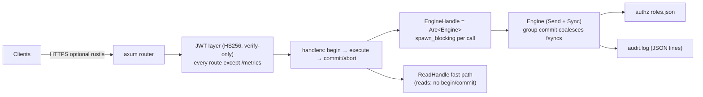
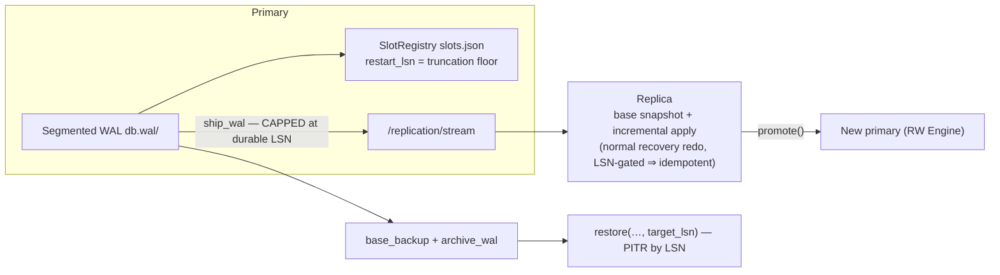

# 11. Server, Replication & Operations

**Modules:** `server/*` (feature-gated), `replication/*`, `backup/*`, `authz/*`,
`audit/*`. The embedded crate is primary; everything here is optional and the
default build carries **zero async dependencies**.

---

## 11.1 Server architecture

No engine mutex behind the handlers: since P5.e the `Engine` is `Send + Sync`,
handlers run blocking calls on tokio's blocking pool, and concurrency is
coordinated by the engine's own latches/locks/WAL — more concurrent committers
means *fewer* collective fsyncs (group commit). The HTTP layer adds only ~6 %
over a direct `Engine::insert` call.

### Routes

| Area | Routes |
|---|---|
| SQL / Cypher | `POST /sql`, `POST /cypher` |
| Raw rows | `POST /rows`, `GET/PUT/DELETE /rows/{page_id}/{slot}` |
| Graph | `POST /edges`, `DELETE /edges/{page_id}/{slot}`, `GET /edges/from/{from_id}` |
| Indexes | `POST /indexes`, `GET /indexes/{table}/{column}/status` |
| Tables / events | `GET /tables` (system `__…__` hidden), `POST /tables/{t}/events`, `GET /events/subscribe` (SSE), `POST /events/ack` |
| Ops | `POST /checkpoint`, `GET /stats`, `GET /metrics` (public) |
| Replication | `POST/GET /replication/slots`, `DELETE /replication/slots/{name}`, `POST /replication/slots/{name}/advance`, `GET /replication/stream` |

`POST /sql` dispatch order: auth DDL → superuser-gated `execute_sql_as`;
privilege pre-check (`authorize_sql`); parameterized statements bind `$n` as
data (injection-safe); read-only SELECT → the concurrent read path; everything
else → writer path with commit-or-abort wrapping.

## 11.2 Security

- **JWT** — stateless verify-only HS256 (`UNIDB_JWT_SECRET`); the `sub` claim is
  the unidb username; a token without `sub` is the implicit superuser
  (backward compatible). `/metrics` is deliberately outside the JWT wall
  (Prometheus scrapers carry no bearer token — firewall it at the network
  layer).
- **Roles/GRANT (`roles.json`)** — users (optional SUPERUSER), roles, transitive
  membership, per-table SELECT/INSERT/UPDATE/DELETE/ALL. Auth DDL (`CREATE
  USER/ROLE`, `GRANT/REVOKE …`) has its own small parser. Atomic
  write-tmp+rename persistence. **Bootstrap mode:** until the first
  `CREATE USER … SUPERUSER`, everyone is an effective superuser — pre-P6.e
  behavior preserved.
- **Audit (`audit.log`)** — append-only JSON lines: all auth DDL, plus every
  named-user access decision (allowed *and* denied). The implicit embedded
  superuser's data ops are not audited (trusted operator); fsync-free append off
  the hot path.
- **TLS** — native rustls (aws-lc-rs) when `UNIDB_TLS_CERT`/`UNIDB_TLS_KEY` are
  set; no reverse-proxy assumption. Encryption-at-rest is deferred (D9
  sign-off-gated).
- Error contract: typed `DbError → (HTTP status, code)` — e.g. 409
  `WRITE_CONFLICT`/`SERIALIZATION_FAILURE`/`DEADLOCK`, 403 `PERMISSION_DENIED`,
  **503 `DURABILITY_FAILURE`** (fsyncgate — session poisoned; restart is the
  remedy).

## 11.3 Replication & HA (Phase 6)

The load-bearing correctness rules:

- **Never ship past the durable frontier.** Records physically in the WAL file
  but not yet fsynced must not reach a replica — otherwise a promoted replica
  could hold commits the crashed primary never made durable (divergence). Proven
  by a dedicated test: after a primary crash drops its unsynced tail, the
  replica is still a strict prefix.
- **Ship at commit boundaries** — a replica only ever applies complete committed
  transactions and never needs undo.
- **Slots hold the truncation floor**: checkpoint truncates to
  `min(checkpoint_lsn, min slot restart_lsn)`; `advance` is monotonic (a stale
  confirmation never rewinds retention). A stuck slot pins the WAL — the classic
  footgun, surfaced as `/stats max_replication_lag`.
- **Sync replication option**: a `{"sync": true}` slot plus
  `wait_for_sync_replicas(lsn, timeout)` after commit ⇒ failover loses no
  acknowledged commit; the async default may lose the last un-shipped commits
  (documented trade-off).
- **Backup/PITR**: `base_backup` (consistent, post-checkpoint, directly
  openable) + `archive_wal` (sealed segments are append-only ⇒ plain copies) +
  `restore(base, archive, dest, target_lsn)` — rebuilds the WAL up to the target
  and runs ordinary crash recovery. PITR is **by LSN**; time-based PITR needs
  commit timestamps in the WAL (filed).

**Documented limitation (both replica and PITR):** freshly *allocated* pages are
not FPI-covered, so incremental redo can only reconstruct pages present in the
base — steady-state updates are fine, but a workload that keeps allocating new
pages needs periodic re-basing. The full fix (FPI-covering fresh pages) is a
tracked follow-up.

## 11.4 Observability

- **`/metrics`** (Prometheus): HTTP metrics + engine gauges refreshed per scrape
  — `unidb_autovacuum_runs_total`, `unidb_dead_tuple_estimate`,
  `unidb_live_tuple_estimate`, `unidb_autovacuum_last_run_epoch_secs`,
  `unidb_jwt_verify_seconds` (histogram), `unidb_sse_poll_cycles_total`,
  `unidb_sse_events_delivered_total`.
- **`GET /stats`** (pg_stat-style): commits, aborts, checkpoints,
  active_transactions, wal_bytes, replication_slots, max_replication_lag,
  data_pages, recent_slow_queries.
- **Slow-query log**: `set_slow_query_threshold` → `tracing::warn` + a bounded
  ring exposed via `/stats`.
- **Structured logging (D13)** from day one for WAL writes, checkpoints, and
  recovery replay — "did recovery work" is answerable from logs.
- `docs/ops_runbook.md` covers deployment, replication setup, backup schedules,
  and failure drills.

## 11.5 Border cases

| Case | Handling |
|---|---|
| Replica applies the same stream twice | LSN-gated redo — idempotent (tested) |
| Primary crashes mid-ship | durable-frontier cap ⇒ replica remains a prefix |
| Stale slot confirmation | monotonic advance — retention never rewinds |
| JWT with no `sub` | implicit superuser (compatibility); first CREATE USER closes bootstrap mode |
| Denied access | audited with decision + reason |
| fsync failure under load | 503 `DURABILITY_FAILURE`; session poisoned by design |
| SSE subscriber backlog | poll-loop model — no unbounded server buffering; acks only via REST |
