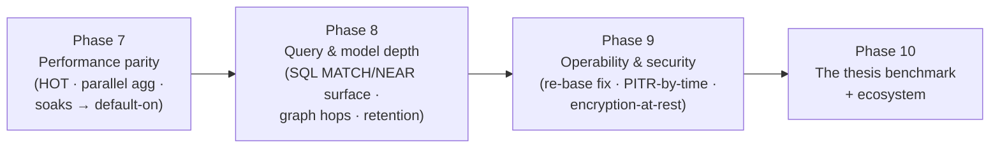

# 12. Future Roadmap — Goals, Milestones, Phases

> **Status: proposal.** Everything here is drawn from follow-ups already *filed*
> in `MEMORY.md`, `PROGRESS.md`, and `docs/backlog/`, organized into coherent
> phases. Per `CLAUDE.md §0/§10`, nothing below is authorization to start work —
> each phase needs explicit sign-off, and backlog items must be registered per
> `docs/backlog/CONVENTIONS.md`. Locked decisions (§3) still require recorded
> sign-off to change.

---

## 12.1 Where the engine stands

Phases 1–6 of the roadmap are complete: ACID hardening, data-model depth, durable
multi-model storage (the O(1)-open moat), query power, concurrency & performance,
and operations/HA. Items 71–99 (CRUD performance sprint, HNSW caches, plan cache,
O(1) COUNT(*), batch INSERT, batch-sql, SQL authz DDL) have shipped on top of
that baseline. The engine is a deployable single-primary system with:

- Replicas, backups, PITR by LSN, JWT auth, SQL DDL roles/grants/policies
- Parallel scan workers (default-on; 5 primitives including parallel DELETE)
- HOT UPDATE chains (same-page + cross-page) reaching **0.62× PG** (Docker bench)
- DELETE selected at **0.81× PG**; GROUP BY at **1.44× PG**; COUNT(*) at **6.80× PG**
- 1,024-entry plan cache (537–891× parse speedup)
- O(1) COUNT(*) via catalog `row_count`
- DiskHnswIndex with L0/vec caches (0.79 ms warm at 1k, 2.38 ms at 10k)
- `POST /batch-sql`, `POST /bulk` (60–87k rows/s), CDC management API

Honest gaps (as of 2026-07-19): INSERT per-row 0.55× PG; UPDATE HOT 0.62×;
non-HOT UPDATE 0.42×; no GROUP COMMIT for SERIAL INSERTs; HNSW 21× behind
ffsdb at 10k warm.

## 12.2 North-star goals

1. **Win the workload the engine was built for** — publish the cross-domain
   "replaced stack" benchmark (one unidb transaction vs Postgres + vector store
   + graph DB + queue with app-level glue). This is the thesis test and is
   explicitly deferred, confirmed as its own dedicated effort.
2. **Single-model parity where it's honest to chase it** — UPDATE-heavy
   workloads (HOT) and large scans (parallel follow-ups); *not* out-Postgresing
   Postgres everywhere.
3. **Zero-surprise operations** — close the documented re-base, PITR-by-time,
   and retention footguns.
4. **Keep the invariants tested** — every phase extends the crash harness and
   benchmark ledger; no silent regressions of D1–D13.

## 12.3 Proposed phases

### Phase 7 — Performance parity (highest measured ROI first)

| Item | What / why | Filed at |
|---|---|---|
| **HOT-style same-page updates (A2)** | The real path to UPDATE parity: forward-chained heap + stable index target; needs format + recovery change (gated) | Phase-A closeout |
| Parallel `SUM`/`GROUP BY` partial aggregates; `LIMIT`/`ORDER BY…LIMIT` early-stop | extend the Milestone-P pattern to the remaining serial tails | `docs/backlog/parallel_scan.md` |
| Planner column pruning for `query_exec` scans | decode pushdown for the Query route (fast path already has it) | Phase-B closeout |
| ~~Soak → default-on for `UNIDB_PARALLEL_SCAN`~~ **DONE 2026-07-11** (backlog item 15: global worker cap + cancellation, then flipped default-ON) · remaining: soak → default-on for `UNIDB_CONCURRENT_SQL_WRITES` | shipped default-off with a revert switch; flipping is a recorded decision | `MEMORY.md`, `15_parallel_worker_governance.md` |
| B-link/optimistic descent (Lehman-Yao), per-table lock registry (0b), heap-tail spread (Item B), atomic/batched SERIAL | residual write-concurrency items; B-link is format-bump-gated | `index_write_concurrency.md` |
| Visibility-map-style shortcut for `COUNT(*)` | removes the O(pages) header-scan ceiling at large scale | Phase-B notes |

**Exit criteria:** UPDATE bulk ≥ 0.8× PG at matched durability; filtered scans
≥ 0.8× PG; both toggles default-on after soak; crash harness extended for HOT.

### Phase 8 — Query & model depth

| Engine | Item |
|---|---|
| SQL | `WHERE MATCH` (full-text) and richer `NEAR` SQL surface (metric/nprobe hints); window functions; `WaitPolicy::Wait` + EvalPlanQual-style RC re-evaluation; predicate-level SSI (phantom protection) |
| Vector | centroid **re-training as a maintenance op** (vacuum-like); filtered-NEAR pushdown; DiskANN behind the same interface if recall/latency demands it |
| Graph | multi-hop / variable-length traversal (re-introduces CSR value — gated on the staleness/generation-marker design); nodes table with properties; OPTIONAL MATCH, aggregation |
| Full-text | ranking (BM25), stopwords/stemming options |
| Events | predicate pushdown for `poll_events`; declarative retention policy (auto `vacuum_events` with registered-consumer safety) |
| LOBs | transparent TOAST of oversized BYTEA; streaming REST upload/download |

**Exit criteria:** all four models queryable from SQL/Cypher without bespoke
Rust APIs; each new read path MVCC-re-validating and crash-covered.

### Phase 9 — Operability & security

| Item | Closes |
|---|---|
| FPI-cover freshly allocated pages | the re-base requirement for replicas/PITR (doc 11 §3) |
| Commit timestamps in WAL → **PITR by time** | "restore to 14:32" |
| Auto-failover coordinator (external, not consensus) | manual `promote()` today; stays within the no-distributed-consensus scope |
| Encryption-at-rest | **D9 sign-off-gated** (mmap page store + on-disk format) |
| Hard read-only guard for replica `read_engine()` | documented soft spot |
| Per-table autovacuum + cost throttling | global pass today |
| RLS enforcement over the bespoke engine APIs | `edges_from`/`poll_events` bypass documented in docs 8–9 |
| Crash-safe user-txn-scoped catalog changes | request-level DDL rollback today |

**Exit criteria:** a replica can run indefinitely without re-base; a
time-targeted restore drill in the runbook passes; security review of at-rest
story recorded.

### Phase 10 — The thesis benchmark & ecosystem

- **The cross-domain replaced-stack benchmark** (`CLAUDE.md §6`): one
  transactional workload touching row + embedding + edge + event, unidb vs
  (Postgres + vector store + graph DB + queue) with app glue; native-Linux
  publishable numbers (the Docker fair-fsync path already exists).
- Language bindings beyond `unidb-attach` (Python first); connection-pool
  guidance; example applications exercising all four models in one txn.
- Parked-and-explicitly-out-of-scope items stay out until re-litigated with
  sign-off: S3 tiering, compression, extensions, distributed consensus, full
  ANSI SQL.

## 12.4 Standing invariants for every future phase

1. Crash harness green and **extended** wherever storage is touched (D7 — 29
   points and growing; a phase that touches recovery adds points, never skips).
2. Benchmark table (throughput, p50/p99, peak RSS, honest baseline) in
   `PROGRESS.md` per milestone — evidence over aspiration (§6).
3. No page write before its WAL record (D5), ever; no locked decision (§3)
   re-opened without recorded human sign-off.
4. New features ship behind **default-off toggles with runtime reverts** when
   they change concurrency or planner behavior (the pattern that made crabbing
   and parallel scan safe to land).
5. Docs updated in the same PR (`README.md`, `docs/design/*`, backlog status
   flips) — stale docs are treated as bugs (§9), corrections inline, never
   silent rewrites.

## 12.5 Risk register

| Risk | Mitigation |
|---|---|
| HOT update work destabilizes recovery | format-bump + new crash points before enabling; keep insert-new-version as fallback path |
| Default-on toggles regress a workload | soak period + runtime revert switches already in place |
| CSR read-path reintroduction repeats the M7 self-visibility bug | generation-marker design is a hard precondition; isolated-binary test runs (the lesson from M7) |
| Benchmark credibility | matched-durability discipline; publish environment + both lenses; native Linux for headline numbers |
| Scope creep vs the unification thesis | §12.3 phases map 1:1 to filed backlog items; anything else needs a new backlog entry + sign-off first |
